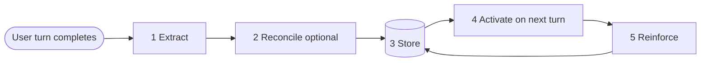

# collabMEM

**An open architecture for cognitive memory in LLM chat applications.**

> This is **not a library, plugin, SDK, package, or hosted service.** It is architectural reference documentation for building your own cognitive memory layer into an LLM chat application. It is designed to be read by both human developers and LLM coding assistants as implementation guidance.
>
> There is no `npm install`. There is no `import collabmem`. You will build your own implementation, shaped to your app, using the patterns, object shapes, UX principles, and lifecycle decisions described here.

---

## What this is

collabMEM is a set of architectural documents that describe how to build a **cognitive memory layer** alongside an LLM chat application. A cognitive memory layer is the part of a chat app that:

- observes each conversation turn
- extracts structured, typed memory from it
- stores that memory with provenance
- retrieves the right memory for future turns
- reinforces what is useful and lets the rest decay
- exposes all of the above to the user for inspection and manual control

The architecture applies equally to:

- single-assistant chat apps (one user, one model)
- multi-assistant chat apps (one user, several models in parallel)
- agent systems (planners, researchers, critics, tool agents)

It is deliberately **model-agnostic, storage-agnostic, and framework-agnostic**. The decisions that matter are the loop itself and the shapes of the memory it creates — not which database, which model provider, or which UI framework you use.

## Why collabMEM exists

The default answer to "how do I optimize memory for my LLM chat app?" has become "use models with a bigger context window" or "retrieve chunks from a vector DB" or "use Karpathy's Obsidian-based wiki." Unfortunately, none of those is actual "memory" in the sense of an LLM autonomously learning from conversations and updating itself. In Karpathy's wiki solution, it's better described as a **structured, LLM-curated external knowledge store** — closer to a smart personal wiki than to persistent model memory.

### The BIGGER problem - context-window constraints

Every modern LLM chat app faces the same failure mode. As a conversation grows, the implementation stacks user and assistant turns into the prompt until it fills the model's context window. This sounds harmless. In practice it has four compounding costs:

1. **Rising cost per turn.** Every new turn is priced against the ever-growing prompt.
2. **Attention dilution.** The model is asked to attend to more and more irrelevant history. Quality drops.
3. **Lost-in-the-middle.** Information buried between the start and end of a long prompt is statistically more likely to be ignored.
4. **Hard ceiling.** Eventually the window fills and the app must truncate, summarize on the fly, or start a new conversation.

"Use a bigger context window" defers these costs. It does not solve them.

### What collabMEM does differently

collabMEM's **primary purpose** is to **reduce context-window strain**. Instead of stacking turns, the system:

- extracts structured memory from each turn and persists it outside the prompt
- replaces verbatim turn history with compact **salient digests**
- **activates only the most relevant** memory for the next prompt (typed memory objects + digests), not the whole transcript
- keeps the total context footprint at a **stable maximum threshold well below the model's limit**, regardless of conversation length

The result is that a chat which has gone on for a hundred turns sends the assistant roughly the same amount of context as a chat at turn ten — just a different selection. Cost stays predictable, attention stays focused, quality does not decay with length, and the hard ceiling is never reached.

### What memory means here

Memory is:

- **structured** — not a transcript dump
- **typed** — different kinds of knowledge get different treatment
- **inspectable** — the user can see what is stored
- **mutable** — the user can correct it
- **provenance-aware** — every item knows where it came from
- **selective on the way out** — only relevant memory enters the next prompt
- **reinforcing** — use strengthens, disuse weakens
- **external to the context window** — stored in its own store, injected selectively, never replacing itself with an ever-growing transcript

collabMEM documents an architecture that treats memory this way. It was originally developed as the cognitive layer of [collaborAItr](https://www.collaboraitr.com), a multi-model parallel chat application, specifically because the multi-model case magnifies the context-window problem: N models running in parallel each need context, and stacking turns into each of them scales multiplicatively. This repository documents the **architecture** abstracted from that implementation, in a form any team can adapt.

## What you get

A small set of typed memory objects:

| Asset             | Purpose                                                                |
| ----------------- | ---------------------------------------------------------------------- |
| Engrams           | durable memory units (one concept, one content block, one confidence)  |
| Associations      | weighted, typed edges between engrams                                  |
| Salient digests   | compact per-turn structured summaries                                  |
| Meta-Vault        | durable cross-conversation patterns about the user                     |
| Consensus reports | optional — merged proposals when reconciliation produces multiple ones |
| Extraction log    | optional — operational telemetry                                       |

A five-stage cognitive cycle:

Two inspection surfaces that are part of the architecture, not a debugging add-on:

- a **Memory Inspector** that shows what the system remembers
- a **Payload Inspector** that shows what the assistant actually received

A reconciliation layer that is **optional and configurable**, with six supported modes that cover everything from "a human approves each memory" to "several models independently propose memory and we merge by agreement."

A token-budgeted activation pass that holds the prompt at a stable size rather than letting it grow with the conversation.

A complete, opinionated set of principles about local-first storage, user-owned memory, provenance, and selective activation.

## Who it's for

- Developers building a chat app from scratch who want a defensible memory architecture instead of piling on retrieval hacks.
- Teams adding memory to an existing chat app who want a coherent target to aim at.
- LLM coding assistants being asked to implement a memory layer — these docs are written to be loadable as context and unambiguous when quoted.
- Anyone designing a multi-agent system who wants structured, user-inspectable memory rather than a shared vector blob.

## How collabMEM compares to other memory tools

If you are evaluating collabMEM against the widely-adopted memory tools in the ecosystem — Mem0, Zep / Graphiti, Letta (formerly MemGPT), Cognee, or LangMem — a standalone companion document, [docs/collabMEM_differentiators.md](docs/collabMEM_differentiators.md), walks through each comparison in detail and is worth reading before adoption.

It makes the case that memory is **an architecture problem, not a retrieval problem**, and covers:

- A deep dive on the **salient digest** — the compression mechanism that holds the prompt at a stable token ceiling regardless of conversation length, so a chat at turn 100 sends the model roughly the same amount of context as a chat at turn 10
- Honest, side-by-side comparisons against each of the five tools above, including where each of them is the better choice and the specific gaps collabMEM was designed to close
- A feature-matrix table covering thirteen architectural properties — salient-digest compression, stable context ceiling, typed engrams, Hebbian reinforcement, Bayesian confidence updating, multi-model reconciliation, first-class inspection surfaces, provenance, model- and framework-agnosticism, and local-first storage
- The honest tradeoff — collabMEM gives you the design, not a deployable system, and is not the right choice if your only goal is shipping a simple single-session chatbot in the next two weeks

If you are comparing options, start there; if you are already convinced, you can skip it and move on to the architectural chapters.

**NOTE:** There is a second document that [compares collabMEM to Karpathy's LLM Wiki](docs/collabMEM_vs_Karpathy_wiki.md) solution for an individuals' knowledge graph vs for LLM harness applications, and how they can be combined for an even more robust solution.

## Inspired by biology

The terminology in these docs is borrowed from cognitive neuroscience. The words are chosen because the analogies hold usefully, not because the system claims biological equivalence.

An **engram** — a term coined by Richard Semon in 1904 — is a small, discrete, reinforceable trace of an experience. In the brain it is distributed across neurons, dormant until something triggers reactivation, strengthened by repeated use, and updatable by later learning. The digital engrams in this architecture behave the same way: each one has a concept, a content body, a confidence, a utility score that tracks proven usefulness, and a state that can be active, archived, or superseded.

A **Hebbian association**, from Donald Hebb's 1949 formulation "neurons that fire together wire together," is a weighted connection that strengthens when two things are used together. In this architecture, associations are typed, weighted edges between engrams. Some are proposed semantically by the extraction model ("A depends on B"); others emerge from use itself — every time two engrams are activated in the same turn, their association's weight nudges up and its co-activation counter increments.

The combination — engrams as durable traces, associations as wiring between them — enables something that feels less like a database lookup and more like the spreading-activation cascade of human recall: activating one concept naturally primes its neighbors.

For the full biological framing and how it maps to every field in the architecture, read [docs/02-conceptual-foundation.md](docs/02-conceptual-foundation.md).

## Documentation map

| #   | File                                                                     | Purpose                                                                |
| --- | ------------------------------------------------------------------------ | ---------------------------------------------------------------------- |
| -   | [README.md](README.md)                                                   | This file — positioning, why, reading paths                            |
| 01  | [docs/01-philosophy.md](docs/01-philosophy.md)                           | What this is and what it is NOT; model-agnosticism; core principles    |
| 02  | [docs/02-conceptual-foundation.md](docs/02-conceptual-foundation.md)     | Engrams and Hebbian associations in full                               |
| 03  | [docs/03-architecture.md](docs/03-architecture.md)                       | System architecture overview: components, flows, and context budgeting |
| 04  | [docs/04-asset-taxonomy.md](docs/04-asset-taxonomy.md)                   | The six memory asset types with schema sketches                        |
| 05  | [docs/05-cognitive-cycle.md](docs/05-cognitive-cycle.md)                 | The five-stage loop: extract, reconcile, store, activate, reinforce    |
| 06  | [docs/06-extraction.md](docs/06-extraction.md)                           | The decoupled extraction pattern and output contract                   |
| 07  | [docs/07-reconciliation.md](docs/07-reconciliation.md)                   | Optional reconciliation layer with six modes                           |
| 08  | [docs/08-storage.md](docs/08-storage.md)                                 | Local-first storage and optional sync                                  |
| 09  | [docs/09-retrieval-activation.md](docs/09-retrieval-activation.md)       | How memory comes back into future prompts                              |
| 10  | [docs/10-transparency-mutability.md](docs/10-transparency-mutability.md) | Inspection and user-controlled mutation as first-class features        |
| 11  | [docs/11-implementation-notes.md](docs/11-implementation-notes.md)       | Trade-offs, tuning knobs, pitfalls, evaluation                         |
| -   | [docs/collabMEM_differentiators.md](docs/collabMEM_differentiators.md)   | How collabMEM compares to Mem0, Zep, Letta, Cognee, and LangMem        |
| -   | [docs/glossary.md](docs/glossary.md)                                     | Terms used throughout the docs                                         |

## Reading paths

**Skim (10 minutes).** Read this README. Skim [docs/01-philosophy.md](docs/01-philosophy.md) and [docs/05-cognitive-cycle.md](docs/05-cognitive-cycle.md). If you are comparing collabMEM against other memory tools, read [docs/collabMEM_differentiators.md](docs/collabMEM_differentiators.md) as well. You will know whether this is worth adopting.

**Adopt (60 minutes).** Read in order: [01-philosophy](docs/01-philosophy.md), [03-architecture](docs/03-architecture.md), [04-asset-taxonomy](docs/04-asset-taxonomy.md), [05-cognitive-cycle](docs/05-cognitive-cycle.md), [10-transparency-mutability](docs/10-transparency-mutability.md), [11-implementation-notes](docs/11-implementation-notes.md). You will have enough to design your implementation.

**Deep dive (two hours).** Read every document in numeric order. Pay particular attention to [02-conceptual-foundation](docs/02-conceptual-foundation.md) for the mental model, [07-reconciliation](docs/07-reconciliation.md) for the optionality, and [09-retrieval-activation](docs/09-retrieval-activation.md) for what most teams get wrong.

**Feeding to an LLM coding assistant.** Each chapter is self-contained enough to paste directly as context. Start with the chapter closest to the task (for example, feed [09-retrieval-activation](docs/09-retrieval-activation.md) before asking the assistant to implement the activation engine). Include [01-philosophy](docs/01-philosophy.md), [03-architecture](docs/03-architecture.md), and [04-asset-taxonomy](docs/04-asset-taxonomy.md) as baseline context for any implementation task.

## What this architecture does NOT prescribe

- A specific database. Use IndexedDB, SQLite, Postgres, a document store, a graph store, a vector index, or a hybrid — whatever fits your product.
- A specific extraction model. The production implementation uses a dedicated small model for extraction; that is one reasonable choice among many.
- A specific UI framework. The inspection surfaces are described by information, provenance, and control requirements, not by component libraries.
- A specific prompt. The extraction prompt, its tuning, and its output schema are implementation concerns; this repository defines only the categories the output must cover.
- A specific chat protocol. Memory can be wired into streaming or non-streaming chat equivalently.

## Relationship to collaborAItr

The reference implementation of collabMEM is the cognitive layer of [collaborAItr](https://www.collaboraitr.com). Public-facing documentation of that implementation lives at [collaboraitr.com/collabMEM/](https://www.collaboraitr.com/collabMEM/).

This repository is **abstracted** from that implementation. Specifics that are proprietary to collaborAItr — the exact extraction prompt, tuned thresholds, model identifiers, and certain assets that are not architectural — are not published here. The architecture is.

## Attribution and influences

collabMEM's design was informed by prior long-standing work in the cognitive-memory and knowledge-graph spaces.

The primary sources for each of the techniques below are classical publications in cognitive science, knowledge representation, and information retrieval — in several cases dating back more than a century. collabMEM rests on that public prior art. Two contemporary open projects — MuninnDB and Cognee — are acknowledged as general design inspirations because they surfaced useful combinations of these classical techniques in the modern memory-system context. **Neither project is integrated into collabMEM, and no source code, documentation text, prompt text, or schema from either project has been copied or adapted.** See [NOTICE](NOTICE) for the full independent-implementation statement.

### Cognitive scoring and reinforcement

Three techniques that form the core retrieval and activation pipeline for engrams, ensuring recently-accessed and frequently-used memories surface contextually:

1. **The cognitive scoring foundation — engrams and ACT-R temporal priority.** Engrams as durable, reinforceable traces trace to Richard Semon's *Die Mneme* (1904). ACT-R style temporal / recency-based activation traces to John R. Anderson's ACT-R framework (CMU, 1976 onward; see *The Atomic Components of Thought*, 1998).
2. **Hebbian association weights.** Donald Hebb, *The Organization of Behavior* (1949): "neurons that fire together wire together." collabMEM applies this as co-activation-driven weight reinforcement on typed edges between engrams.
3. **Bayesian confidence reinforcement.** Classical Bayesian updating, from Thomas Bayes (1763) and Laplace (1774) onward. Confidence on an engram is updated as new evidence corroborates or contradicts it.

Surfaced in contemporary memory-systems form by [MuninnDB](https://github.com/scrypster/muninndb) (source-available; see its own license for its terms). collabMEM's treatment is an independent reimplementation of the underlying classical techniques.

### Knowledge-graph and retrieval refinements

Five techniques drawn from standard practice in knowledge representation and information retrieval:

1. **Typed relationship edges on associations for explainability.** Long-standing practice in RDF, property graphs, and semantic networks (Quillian, 1968; Sowa's conceptual graphs, 1984; the W3C RDF / OWL family).
2. **Entity deduplication to prevent memory fragmentation.** Record linkage / entity resolution; foundational work by Fellegi and Sunter, "A Theory for Record Linkage," *JASA* (1969).
3. **Vector-seeded graph expansion for semantic recall.** Spreading activation over a graph from a semantically-retrieved seed; spreading-activation models trace to Collins and Loftus (1975).
4. **Feedback-weighted retrieval where memories learn their own utility.** Relevance feedback in information retrieval; Rocchio, "Relevance Feedback in Information Retrieval" (1971).
5. **Temporal range queries for time-aware memory navigation.** Standard temporal-database practice; Snodgrass and Ahn, "Temporal Databases," *IEEE Computer* (1986).

Surfaced in contemporary memory-systems form by [Cognee](https://github.com/topoteretes/cognee) (Apache License 2.0). collabMEM's treatment is an independent reimplementation of the underlying standard techniques.

### Synthesis

collabMEM synthesizes these classical techniques into a unified system optimized for real-time conversations (single-model, multi-model, and multi-agent), adding inboard extraction consensus and local-first privacy — contributions that are original to collabMEM.

### Academic references

Full bibliographic citations for the classical sources cited above. Where applicable, DOIs or canonical URLs are provided so claims are trivially checkable.

- Anderson, J. R., & Lebiere, C. (1998). *The Atomic Components of Thought.* Mahwah, NJ: Lawrence Erlbaum Associates. ISBN 978-0805828177. Project page: [act-r.psy.cmu.edu](http://act-r.psy.cmu.edu/).
- Bayes, T. (1763). An Essay towards solving a Problem in the Doctrine of Chances. *Philosophical Transactions of the Royal Society of London,* 53, 370–418. DOI: [10.1098/rstl.1763.0053](https://doi.org/10.1098/rstl.1763.0053). (Communicated posthumously by Richard Price.)
- Collins, A. M., & Loftus, E. F. (1975). A Spreading-Activation Theory of Semantic Processing. *Psychological Review,* 82(6), 407–428. DOI: [10.1037/0033-295X.82.6.407](https://doi.org/10.1037/0033-295X.82.6.407).
- Fellegi, I. P., & Sunter, A. B. (1969). A Theory for Record Linkage. *Journal of the American Statistical Association,* 64(328), 1183–1210. DOI: [10.1080/01621459.1969.10501049](https://doi.org/10.1080/01621459.1969.10501049).
- Hebb, D. O. (1949). *The Organization of Behavior: A Neuropsychological Theory.* New York: Wiley. (Reissue: Psychology Press, 2002. ISBN 978-0805843002.)
- Klyne, G., Carroll, J. J., & McBride, B. (Eds.). (2014). *RDF 1.1 Concepts and Abstract Syntax* (W3C Recommendation). [w3.org/TR/rdf11-concepts/](https://www.w3.org/TR/rdf11-concepts/).
- Laplace, P.-S. (1774). Mémoire sur la probabilité des causes par les événements. *Mémoires de l'Académie Royale des Sciences,* 6, 621–656.
- Liu, N. F., Lin, K., Hewitt, J., Paranjape, A., Bevilacqua, M., Petroni, F., & Liang, P. (2024). Lost in the Middle: How Language Models Use Long Contexts. *Transactions of the Association for Computational Linguistics,* 12, 157–173. DOI: [10.1162/tacl_a_00638](https://doi.org/10.1162/tacl_a_00638).
- Quillian, M. R. (1968). Semantic Memory. In M. Minsky (Ed.), *Semantic Information Processing* (pp. 227–270). Cambridge, MA: MIT Press.
- Rocchio, J. J. (1971). Relevance Feedback in Information Retrieval. In G. Salton (Ed.), *The SMART Retrieval System: Experiments in Automatic Document Processing* (pp. 313–323). Englewood Cliffs, NJ: Prentice-Hall.
- Semon, R. (1904). *Die Mneme als erhaltendes Prinzip im Wechsel des organischen Geschehens.* Leipzig: Wilhelm Engelmann. (English: *The Mneme,* trans. L. Simon, London: George Allen & Unwin, 1921.)
- Snodgrass, R. T., & Ahn, I. (1986). Temporal Databases. *IEEE Computer,* 19(9), 35–42. DOI: [10.1109/MC.1986.1663327](https://doi.org/10.1109/MC.1986.1663327).
- Sowa, J. F. (1984). *Conceptual Structures: Information Processing in Mind and Machine.* Reading, MA: Addison-Wesley. ISBN 978-0201144727.
- W3C OWL Working Group. (2012). *OWL 2 Web Ontology Language Primer* (Second Edition) (W3C Recommendation). [w3.org/TR/owl2-primer/](https://www.w3.org/TR/owl2-primer/).

---

If you use or adapt these docs, please include attribution per the [LICENSE](LICENSE).

## License

Dual-licensed:

- **[LICENSE](LICENSE)** — Creative Commons Attribution-ShareAlike 4.0 International (CC-BY-SA 4.0) for open and community use.
- **[COMMERCIAL-LICENSE.md](COMMERCIAL-LICENSE.md)** — a separate commercial license for teams that need to embed this architecture in proprietary products without the ShareAlike obligation.

Most adopters can use this work under CC-BY-SA 4.0. The commercial license is available only if you need to avoid ShareAlike specifically.

## Contributing

This repository is documentation. Please read our [Code of Conduct](CODE_OF_CONDUCT.md) and our [Contributing Scope](CONTRIBUTING.md) documents if you wish to contribute.

If you have found a passage that is unclear, incorrect, or that you believe would improve by restructuring, open an issue using the [docs-feedback template](.github/ISSUE_TEMPLATE/docs-feedback.md). If you want to discuss applying the architecture to your own project, use the [adoption-question template](.github/ISSUE_TEMPLATE/adoption-question.md).

Pull requests are welcome for typos, clarifications, additional diagrams, and non-proprietary reference implementations in companion repositories. Architectural changes should be discussed in an issue first.