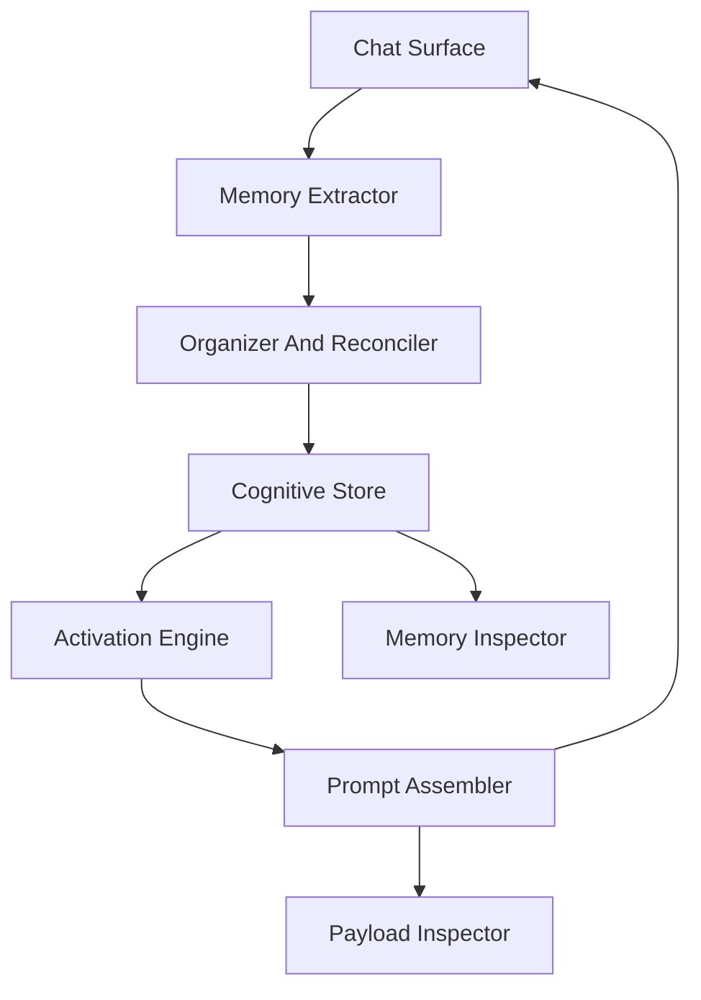
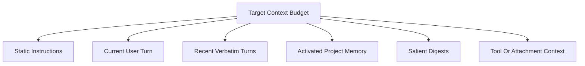
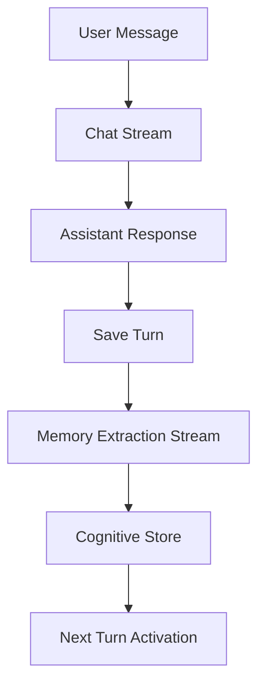

# 03. Architecture

This architecture describes a cognitive memory layer for LLM chat apps. The layer sits beside the chat assistant, observes conversation turns, extracts structured memory, retrieves relevant memory for future prompts, and exposes its behavior to the user.

It can be used in a single-assistant app, a multi-assistant app, or an agentic workspace. The same conceptual modules apply even when the implementation details differ.

The architecture exists primarily to reduce context-window strain. Instead of appending more and more raw turns until a model reaches its context limit, the system maintains structured project memory and compact salient digests, then assembles a smaller prompt containing only what the current turn needs.

---

## System Layers

---

## 1. Chat Surface

The chat surface is where users and assistants exchange messages. It owns the visible conversation state, streaming behavior, and turn structure.

The memory layer should not block normal chat interaction. If extraction or organization takes time, run it after the assistant response completes or in a background job.

The chat surface should not be responsible for endless transcript accumulation. It can keep recent turns for conversational flow, but long-term continuity should come from activated memory and digests.

## 2. Memory Extractor

The extractor reads a completed turn and proposes structured memory candidates. It should produce candidates that are compact, typed, and reviewable.

Common extraction outputs:

- Candidate engrams.
- Candidate associations between engrams.
- Candidate salient digest.
- Candidate Meta-Vault entries.
- Audit metadata about the source turn.

The extractor can be an LLM call, a deterministic parser, a rules engine, or a hybrid.

## 3. Organizer And Reconciler

The organizer turns raw candidates into durable memory objects. It should deduplicate concepts, normalize labels, attach provenance, and decide whether items are active, pending, or rejected.

Responsibilities:

- Canonicalize repeated concepts.
- Merge equivalent memory candidates.
- Preserve uncertainty rather than hiding it.
- Route high-risk items to review.
- Apply user edits and overrides.
- Maintain relationship edges between memory objects.

Reconciliation can be lightweight in a single-model app and more elaborate in multi-model or agentic systems. See [Reconciliation](07-reconciliation.md).

## 4. Cognitive Store

The store holds typed memory objects and their audit trail. It does not need to be a single database. A practical implementation might combine relational tables, document storage, graph edges, and vector indexes.

Recommended logical collections:

- Engrams.
- Associations.
- Salient digests.
- Meta-Vault entries.
- Audit records.
- User control records.

The store should track state transitions, not just final content. Memory that was edited, suppressed, archived, or restored should keep enough history to support user trust and debugging.

## 5. Activation Engine

The activation engine chooses which memory matters for the next prompt. It should score memory against the current turn, then produce a small set of relevant items.

Useful signals:

- Textual relevance.
- Recency.
- User-pinned importance.
- Past usefulness.
- Association strength.
- Conversation or workspace scope.
- Explicit user suppression.

The output should be compact and explainable. Its job is to keep the prompt below the application's chosen context threshold while preserving the information most likely to improve the answer.

## 6. Prompt Assembler

The prompt assembler creates the dynamic memory context that is sent to the assistant. It should separate memory context from static system instructions and ordinary conversation history.

Recommended prompt sections:

- Static system instructions.
- Active memory context.
- Salient recent history.
- Current user turn.

Avoid making the prompt assembler a hidden dumping ground. Its task is context budgeting, not just concatenation.

Recommended behavior:

- Set a target context budget well below the model's maximum context window.
- Reserve space for the current user turn and necessary system instructions.
- Prefer activated memory over stale transcript history.
- Prefer salient digests over long verbatim history when the exact wording is not required.
- Drop low-relevance memory rather than exceeding the target budget.

If memory affects a prompt, that influence should be visible in a payload inspector or similar audit surface.

## 7. Context Budgeting

Context budgeting is the practice of deciding how much prompt space each information source is allowed to consume.

The target budget should be an application-level operating threshold, not the model's maximum context window. Staying below that threshold helps reduce cost, latency, and confusion from irrelevant context.

## 8. Transparency UI

The transparency UI is part of the architecture, not a debugging add-on. It lets users inspect stored memory, understand prompt influence, and manually mutate memory.

Two UI surfaces are especially useful:

- **Memory Inspector:** shows what the system knows.
- **Payload Inspector:** shows what the assistant received.

See [10. Transparency and Mutability](10-transparency-mutability.md).

## Two-Stream Pattern

For responsive chat apps, separate the chat stream from the memory stream.

This keeps the assistant UI fast while still allowing the memory layer to work after each turn.

## Deployment Options

The architecture is intentionally implementation-neutral.

Common choices:

- Local browser storage for personal chat apps.
- SQLite for desktop apps.
- Postgres for web apps with account sync.
- Vector search for semantic retrieval.
- Graph storage or edge tables for associations.
- Object storage for export bundles or snapshots.

The storage backend is less important than preserving typed memory, provenance, user control, and prompt auditability.
