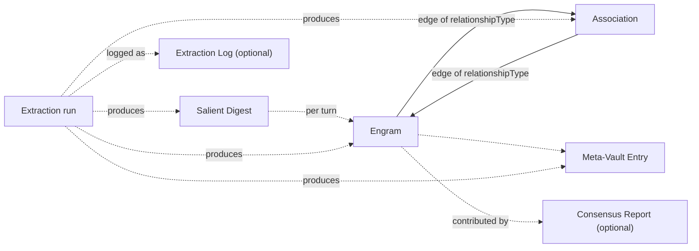

# 04. Asset Taxonomy

This chapter defines the memory objects this architecture stores. Each object is typed, inspectable, and mutable. The set is **six asset types**: four required, two optional.

Object shapes are shown as **TypeScript-style type sketches**. They are illustrative, not prescriptive. Use whatever field names, ID schemes, or storage primitives fit your stack. What matters is that the categories of information listed here exist in some form.

> **Note on implementation details.** Some fields that appear in the reference implementation (for example, a canonical-concept lookup table used for deduplication) are not user-visible assets and are not part of this taxonomy. They are storage plumbing, not architecture. A pointer to that kind of detail appears at the end of this chapter.

---

## 1. Engrams

Durable memory units. Each engram captures one reusable piece of knowledge — a fact, preference, decision, constraint, project detail, or recurring instruction.

### Purpose

Engrams are the primary recall targets. Most "remembered" behavior in a chat app is engram activation.

They are also how the architecture moves durable knowledge **out of the prompt and into storage**. Instead of re-sending a piece of context on every turn (inflating the prompt as the conversation grows), knowledge is captured once as an engram and injected only on turns where activation decides it is relevant. This is what makes a bounded prompt possible: the store carries the accumulated knowledge, the prompt carries only the current slice of it.

### Schema sketch

```typescript
type Engram = {
  id: string;
  concept: string;          // 2-5 word label, e.g. "prefers cloud deployment"
  content: string;          // fuller body elaborating the concept
  state: "active" | "archived" | "superseded" | "pending" | "suppressed";
  confidence: number;       // normalized 0..1 or an enum you define
  utilityScore: number;     // learned usefulness; adjusted by activation outcomes
  accessCount: number;
  lastAccessAt: string;     // ISO-8601
  tags?: string[];
  scope: "user" | "workspace" | "project" | "conversation";
  scopeId: string;
  promotionHistory?: Array<{
    fromScope: "user" | "workspace" | "project" | "conversation";
    toScope: "user" | "workspace" | "project" | "conversation";
    promotedAt: string;
    reason: "access_count" | "utility" | "cross_conversation" | "manual";
  }>;
  provenance: {
    conversationId?: string;
    turnNumber?: number;
    createdAt: string;
    sourceProducers?: string[]; // e.g. model ids, user, verifier agent
    origin: "extracted" | "manual" | "imported";
  };
  userEdit?: {
    editedAt: string;
    editedBy: string;
    previousContent?: string;
  };
};
```

### Lifecycle

- **Created by**: extraction (per turn), user (manual add), import (bulk)
- **Updated by**: extraction updates, user edits, reinforcement passes
- **Ends at**: state transitions to `archived`, `superseded`, or `suppressed`. Hard deletion is a product policy choice, not an architectural requirement.

### Visibility

Every engram must be visible to the user in the [Memory Inspector](10-transparency-mutability.md), with full provenance, current state, confidence, and utility.

Every engram has a `scope` (`user | workspace | project | conversation`) and a `scopeId`. Activation queries scopes in order from narrowest (conversation) to widest (user) and merges results. Conversation-scoped memory is auto-stored. Project/workspace promotion requires either repeated observations or strong utility/access signals, and lands in `state: "pending"` for user approval. User-level memory requires explicit user approval. Promotion history is preserved per engram.

---

## 2. Associations

Weighted, typed edges between engrams. Encodes both explicit semantic relationships and emergent Hebbian co-activation.

### Purpose

Associations let the activation engine bring in relevant neighbors when one engram becomes a seed. They also expose the structure of what the system "thinks" belongs together.

### Schema sketch

```typescript
type Association = {
  id: string;
  sourceEngramId: string;
  targetEngramId: string;
  relationshipType:
    | "depends_on"
    | "contradicts"
    | "supersedes"
    | "prefers_over"
    | "often_relevant_with"
    | string;                  // applications may add types
  relationshipLabel?: string;  // human-readable, e.g. "depends on"
  weight: number;              // normalized 0..1
  coActivations: number;       // how often both engrams were retrieved together
  lastCoAccessAt?: string;
  directed: boolean;
  provenance: {
    createdAt: string;
    origin: "semantic" | "usage";  // Pathway A vs Pathway B
    sourceProducers?: string[];
  };
};
```

### Lifecycle

- **Created by**:
  - Pathway A — the extraction pipeline proposes an edge alongside a new engram (semantic)
  - Pathway B — the activation engine observes two engrams co-activated and creates (or reinforces) the edge (usage)
- **Updated by**: every co-activation event nudges `weight` and increments `coActivations`
- **Ends at**: either source or target engram archived/deleted, or user suppression of the edge itself

### Visibility

Associations are rendered in the Memory Inspector as typed, weighted edges between engrams. Users can see the relationship type in human-readable form, the weight as a confidence-like signal, and co-activation count as a usage signal.

---

## 3. Salient Digests

Compact, per-turn structured summaries. Preserve useful context from a turn without replaying full transcript text.

### Purpose

Salient digests bridge turns without sending the assistant every word of recent history. They are the unit that gets assembled into "recent conversation context" in the next prompt — **in place of verbatim prior turns**.

This substitution is the single largest contributor to the architecture's primary purpose of keeping context-window usage bounded. A salient digest is typically a small fraction of the original turn's token count but preserves the substantive content (decisions, facts, questions, action items). Over the course of a long conversation, digests stand in for dozens or hundreds of turns that would otherwise bloat the prompt.

### Schema sketch

```typescript
type SalientDigest = {
  id: string;
  conversationId: string;
  turnNumber: number;
  producedBy?: string;          // which assistant produced the response that was digested
  quality: "inboard" | "fallback" | "manual";
  summary: {
    decisions: string[];
    facts: string[];
    openQuestions: string[];
    actionItems: string[];
    preferences: string[];
  };
  sourceRange: {
    startTurn: number;
    endTurn: number;
  };
  createdAt: string;
};
```

### Lifecycle

- **Created by**: extraction, one digest per turn per primary producer (single-model apps produce one; multi-model apps can produce one per model)
- **Updated by**: rarely — digests are typically immutable; implementations may allow user edits
- **Ends at**: scope-based retention (for example, collapse old per-turn digests into a per-session digest)

### Visibility

Shown in the Memory Inspector grouped by conversation and turn. The producer attribution is visible to the user so they can see which assistant's take on the turn is being represented.

---

## 4. Meta-Vault

Durable, cross-conversation patterns about the user, workspace, or collaboration style. Meta-Vault entries are deliberately scoped broader than engrams.

### Purpose

Engrams capture concrete knowledge ("the project deploys to a managed VPS"). Meta-Vault captures meta-knowledge that applies across projects and conversations ("the user prefers implementation plans to be concise"). This distinction matters for activation — Meta-Vault entries are often relevant regardless of topic.

### Schema sketch

```typescript
type MetaVaultEntry = {
  id: string;
  concept: string;            // e.g. "communication-style"
  content: string;
  type: "preference" | "style" | "domain_knowledge" | "workspace_convention" | string;
  scope: "user" | "workspace";
  state: "active" | "archived" | "pending" | "suppressed";
  confidence: number;
  userApproved: boolean;
  tags?: string[];
  provenance: {
    firstObservedAt: string;
    lastReviewedAt?: string;
    origin: "extracted" | "manual";
    sourceConversationIds?: string[];
  };
};
```

### Lifecycle

- **Created by**: extraction surfaces cross-turn patterns, or user manual creation
- **Updated by**: user approval/edit, periodic review
- **Ends at**: user archives or rejects the pattern

### Visibility

Meta-Vault entries affect many future conversations, so they require the strictest visibility and edit controls of any asset type. Users should be able to see every active entry, understand why it is active, and turn individual entries off without deleting them.

---

## 5. Consensus Reports *(optional — only when reconciliation produces multiple proposals)*

Merged view of a reconciliation pass. Records what proposals existed, how they were grouped, and what the merged outcome was.

### Purpose

When the reconciliation layer merges multiple proposals (for example, multi-producer agreement in [chapter 07](07-reconciliation.md)), the consensus report is the durable record of that merge. It is both a data asset and an audit trail.

### Schema sketch

```typescript
type ConsensusReport = {
  id: string;
  conversationId: string;
  turnNumber: number;
  producedAt: string;
  totalProducers: number;         // e.g. number of models that contributed
  participatingProducers: string[];
  mergedEngrams: Array<{
    engramId: string;
    agreementCount: number;       // how many producers proposed this engram
    agreementRatio: number;       // agreementCount / totalProducers
    representativeContent: string;
    contributingProducers: string[];
    confidenceBoostApplied: number; // how much agreement lifted confidence
  }>;
  contradictions: Array<{
    engramIds: string[];
    description: string;
  }>;
  relationships: Array<{
    sourceEngramId: string;
    targetEngramId: string;
    relationshipType: string;
    proposedBy: string[];
  }>;
};
```

### Lifecycle

- **Created by**: the reconciliation layer, one per turn that produced multiple proposals
- **Updated by**: typically immutable; implementations may allow user annotation
- **Ends at**: scope-based retention

### Visibility

Consensus reports are presented in the Memory Inspector as their own tab. For each turn, the user can see who proposed what, what was merged, where producers disagreed, and how much agreement lifted the confidence of each merged engram.

---

## 7. Episodes *(optional — temporal-episodic units)*

A bounded, multi-turn span representing a single topic the user worked through with the assistant. Episodes are aggregates **over** salient digests and engrams; they don't replace either, they index them temporally.

### Purpose

Episodes answer "**when** did we work on X?" and "what was the chunk of conversation around the auth-bug fix?" — a class of question that purely semantic activation can't answer well because there's no engram whose content is "we spent Tuesday morning on auth." The information lives in the *shape* of the conversation, not in any individual statement.

They are also the natural unit for retrospectives and for surfacing temporally-coherent context blocks ("here's the 7-turn span where you settled on the cloud-deployment approach") rather than a scattered set of engrams.

### Schema sketch

```typescript
type Episode = {
  id: string;
  scope: "user" | "workspace" | "project" | "conversation";
  scopeId: string;
  conversationId: string;
  startTurn: number;
  endTurn: number;
  startedAt: string;       // ISO-8601
  endedAt: string;
  title: string;           // generated from the digest topics in the span
  summary: string;
  engramIds: string[];     // engrams that landed during this span
  digestIds: string[];     // salient digests that compose the span
  topicTags?: string[];
};
```

### Lifecycle

- **Created by**: a closure detector that runs over the digest stream. Boundaries fire on three signals: consecutive-digest cosine drop above a threshold (semantic shift), explicit user signals like "ok new topic" (lexical shift), or idle gaps beyond a threshold (temporal shift).
- **Updated by**: nothing in steady state — episodes are immutable once closed. A reopen path exists for the user to manually merge two adjacent episodes if the auto-closure was wrong.
- **Ends at**: closure. There is no archive — episodes are append-only history.

### Visibility

Surfaced as a navigable timeline in the Memory Inspector and used by retrieval for queries the activation layer classifies as *temporal* (e.g. "last week", "earlier today", "when did we…"). An activated episode contributes its `engramIds` as a contiguous context block rather than as scattered cards.

---

## 8. Procedures *(optional — procedural memory / "skills")*

A reusable, sequenced workflow — the procedural counterpart to declarative engrams. Procedures encode "how to do X with this user" rather than "what the user thinks about X."

### Purpose

Some things the assistant should do are sequences, not facts: "when the user says 'ship it,' run the test suite, check for type errors, then open a PR with the standard template." That sequence is reusable, has trigger conditions, and benefits from being matched and surfaced rather than re-derived from scattered engrams.

### Schema sketch

```typescript
type Procedure = {
  id: string;
  scope: "user" | "workspace" | "project" | "conversation";
  scopeId: string;
  title: string;
  triggerPatterns: string[];  // intent phrases that should activate the procedure
  steps: Array<{ order: number; description: string; tool?: string }>;
  parameters?: Record<string, { type: string; default?: unknown }>;
  examples?: string[];
  sourceProvenance: {
    origin: "auto_proposed" | "manual";
    derivedFromConversationIds?: string[];
  };
  state: "pending" | "active" | "rejected" | "archived";
  approvedByUser?: boolean;
  invocationCount: number;
  lastInvokedAt?: string;
  utilityScore: number;
};
```

### Lifecycle

- **Created by**: auto-proposal from repeated multi-step exchanges in the digest history, or by manual creation in the Memory Inspector.
- **Updated by**: invocation tracking (count, last-invoked-at), user edits to the steps, and utility re-scoring based on whether invocations led to good outcomes.
- **Ends at**: `state: "archived"` for stale procedures, `"rejected"` for proposals the user declined.

### Visibility

The Memory Inspector exposes a Procedures tab grouped by state. Pending proposals carry a clear approve/reject affordance; active procedures show their last invocation timestamp and a count. Activated procedures inject a `PROCEDURE_MATCH` block into the system prompt so the model can follow the sequence directly.

---

## 9. Consolidation Proposals *(optional — background "dreaming")*

Idle-time clusterings of related engrams into proposed macro-facts or redundant-collapse merges. See [chapter 14](14-consolidation.md) for the full pipeline.

```typescript
type ConsolidationProposal = {
  id: string;
  scope: "user" | "workspace" | "project" | "conversation";
  scopeId: string;
  kind: "macro_fact" | "redundant_collapse";
  status: "pending" | "accepted" | "rejected";
  sourceEngramIds: string[];
  proposedConcept: string;
  proposedContent: string;
  rationale: string;
  createdAt: string;
  resolvedAt?: string;
};
```

Consolidation proposals are *suggestions to the user*, not memory in their own right. Accepted proposals materialize as new engrams (with the source engrams archived); rejected proposals are dismissed without changing the engram graph.

---

## 10. Workspace DataBANK Aggregates *(optional — federated)*

Cross-member rollups of personal sentiment data within a workspace. See [chapter 15](15-federated-databank.md) for the aggregation policy.

---

## 11. Extractor Corrections *(optional — active learning)*

User-authored corrections to specific extractions, replayed as few-shot examples on subsequent extraction passes. See [chapter 06 §Active learning](06-extraction.md).

---

## 6. Extraction Log *(optional — operational telemetry)*

> Numbering note: chapter ordering for §§ 7–11 reflects when the asset types were added to the taxonomy. The Extraction Log retains its original §6 number so existing cross-references and anchor slugs (`#6-extraction-log-...`) continue to resolve.

Per-extraction-run telemetry. Records what happened during an extraction attempt.

### Purpose

Operational visibility. When something looks wrong in the Memory Inspector, the extraction log is where you look first.

### Schema sketch

```typescript
type ExtractionLogEntry = {
  id: string;
  conversationId: string;
  turnNumber: number;
  producerId?: string;          // which assistant's response was being extracted
  extractorId: string;          // the extraction-side component or model family
  startedAt: string;
  endedAt: string;
  durationMs: number;
  quality: "inboard" | "fallback";
  outcome: "success" | "parse_failure" | "schema_failure" | "timeout" | "retry_exhausted";
  retryCount: number;
  countsProduced: {
    engrams: number;
    associations: number;
    digestSections: number;
    metaInsights: number;
  };
  errorSummary?: string;
};
```

### Lifecycle

- **Created by**: the extraction pipeline on every attempt, success or failure
- **Updated by**: append-only; no updates
- **Ends at**: retention policy (log rotation)

### Visibility

The Memory Inspector's Activity tab should render recent extraction log entries so the user can see when memory creation succeeded, failed, or retried.

---

## Plumbing that is NOT an asset

Some structures appear in the reference implementation that are **not** user-visible assets and are not part of this taxonomy. They are implementation aids. Do not expose them as asset types in your Memory Inspector.

- **Canonical concept map.** An optional lookup table that maps raw concept strings to stable canonical labels for deduplication. If you adopt it, treat it as dedup plumbing used by the reconciliation and extraction layers, not as a memory asset in its own right.
- **Sync manifests, batch export envelopes, and similar export/import plumbing.** These are transport-layer structures, not memory.
- **Indexes, embeddings, and similarity caches.** Performance infrastructure that sits beneath the assets above.

---

## Asset relationships at a glance


```mermaid
flowchart LR
    SalientDigest["Salient Digest"] -.per turn.-> Engram
    Engram -->|edge of relationshipType| Association
    Association -->|edge of relationshipType| Engram
    Engram -.-> MetaVault["Meta-Vault Entry"]
    Engram -.contributed by.-> ConsensusReport["Consensus Report (optional)"]
    Extractor["Extraction run"] -.logged as.-> ExtractionLog["Extraction Log (optional)"]
    Extractor -.produces.-> Engram
    Extractor -.produces.-> Association
    Extractor -.produces.-> SalientDigest
    Extractor -.produces.-> MetaVault
```

Engrams are the center. Associations connect them. Salient digests, Meta-Vault entries, consensus reports, and extraction logs all exist to feed or explain the engram graph.

---

## What to read next

- [05-cognitive-cycle.md](05-cognitive-cycle.md) — how these assets move through the five-stage loop
- [06-extraction.md](06-extraction.md) — the extraction pipeline that creates most of them
- [10-transparency-mutability.md](10-transparency-mutability.md) — how each asset type appears in the Memory Inspector
