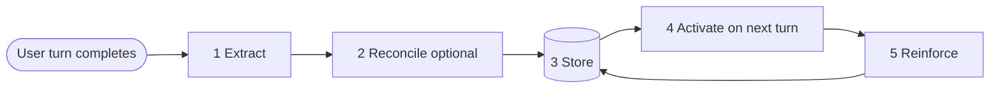
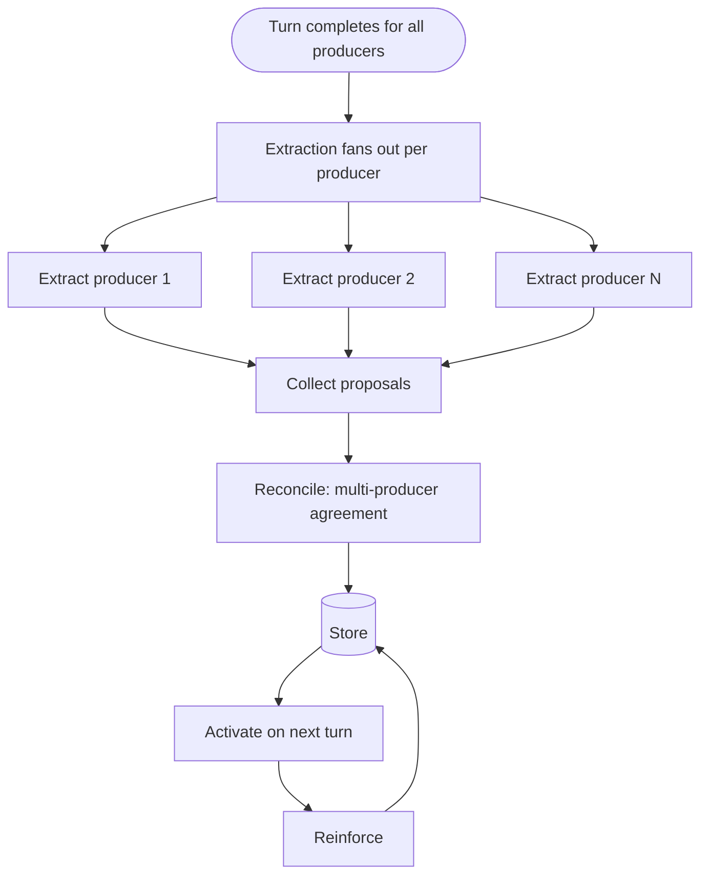

# 05. The Cognitive Cycle

The cognitive cycle is the loop that moves information from a conversation turn into durable, inspectable memory and back into future prompts. Every implementation of this architecture must close this loop. Omitting a stage is how memory systems fail.

There are **five stages**. Stages 1 and 2 run after a turn completes. Stages 3 through 5 run across turns.

The rest of this chapter walks each stage: what it does, what triggers it, sync vs async expectations, failure modes.

---

## Stage 1: Extract

Turn a completed user–assistant exchange into structured memory candidates.

### What it does

The extraction pipeline consumes a completed turn — the user message and the assistant's response — and emits a structured set of memory candidates for that turn: proposed engrams, proposed associations, a salient digest, and optional meta-insights. See [chapter 06](06-extraction.md) for the full pattern.

In a single-model app, extraction runs once per turn. In a multi-model app, extraction runs once per primary producer per turn — so an N-model parallel chat produces N extraction results per turn.

### What triggers it

The completion of a turn. Not the completion of a stream — the completion of the exchange. If your assistant streams token-by-token, wait until the stream closes and the turn is committed to conversation state before kicking off extraction.

### Sync vs async

**Async, always.** Extraction must not block the chat UI. If extraction takes 3 seconds, the user should have seen the assistant's response 3 seconds ago. The reference implementation uses a dedicated SSE connection so the chat stream is never delayed by memory work. See [chapter 06](06-extraction.md) for the decoupled-stream pattern.

### Failure modes

- **Parse failure.** The extraction model produces output that does not match the expected schema. Mitigation: bounded retries; a minimal fallback digest (just the turn summary) for permanent failures.
- **Timeout.** The extraction model does not respond in a reasonable window. Mitigation: declare failure, log, move on. Do not let the UI notice.
- **Producer-level partial success.** In multi-producer mode, some producers succeed and some fail. Mitigation: reconcile with whatever succeeded; record the missing producers in the extraction log.

---

## Stage 2: Reconcile *(optional)*

Turn raw candidates into durable memory — or queue them for review.

### What it does

Reconciliation validates shape, deduplicates against existing memory, detects contradictions, decides what becomes active, and records provenance. It is what separates "raw extractor output" from "something you trust enough to shape future prompts."

Reconciliation has six supported modes, covered in [chapter 07](07-reconciliation.md):

1. Human-in-the-loop review
2. Verifier pass (second LLM)
3. Rule-based validation
4. Deferred correction via mutation
5. Multi-producer agreement
6. Ensembled same-model agreement

A single-model app with manual user review is still doing reconciliation. Consensus across independent producers is a special case, not the default.

### What triggers it

Completion of stage 1. If you chose mode 4 (deferred correction), reconciliation effectively runs at store time with minimal validation, and the "real" reconciliation happens later as the user edits.

### Sync vs async

**Async** in almost all cases. Reconciliation can take as long as it needs.

In the multi-producer mode, reconciliation has a subtle timing issue: it waits for N producers' extractions to arrive, then merges. Producers can fail or time out. The pattern is to wait up to a partial-finalize timeout, merge what arrived, and if late results show up, re-finalize.

### Failure modes

- **All proposals rejected.** Schema validation or rule checks reject everything. Mitigation: keep the salient digest even if no engrams survive.
- **Merge ambiguity.** Two proposals are similar but not identical — merge or keep separate? Mitigation: explicit threshold (implementation choice), plus a "pending review" state so the user can resolve ambiguity.
- **Contradictions.** A new proposal contradicts existing memory. Mitigation: preserve both, mark the relationship as `contradicts`, lower confidence, route to review.

### Notation

This stage is labeled "optional" in the diagram because the **reconciliation layer as a distinct step** is optional — the simplest single-model app may collapse it into basic schema validation at store time. But **some form of organization before storage is required**. "No reconciliation" means "no quality floor for what enters memory."

---

## Stage 3: Store

Persist reconciled memory with full provenance.

### What it does

Store the surviving memory objects in the chosen storage backend, with all provenance intact. Update existing objects in place when reconciliation merged a proposal. Preserve state transitions — if an engram was active, archived, and then restored, that history should be inspectable.

### What triggers it

Completion of stage 2. In mode 4 (deferred correction), stage 2 is minimal, and stage 3 accepts proposals with "pending" state and lets the user fix them later.

### Sync vs async

**Async** at the turn level, but synchronous within itself. By the time stage 3 completes, the memory is durable; any failure between reconciliation and the durable write is a correctness bug.

### Failure modes

- **Partial write.** Some objects persist, some do not. Mitigation: transactional writes where supported; idempotency keys elsewhere.
- **Schema drift.** The store's schema has changed since the last deployment. Mitigation: versioned schemas, migrations, and extraction output that is robust to unknown fields.
- **Conflict with user edits.** A user edited an engram between extraction and storage. Mitigation: user edits always win. If the proposed update differs from the user's value, either skip the update or route it to review.

### Storage backends

This architecture is storage-agnostic. The reference implementation uses IndexedDB (via Dexie) as the primary store and Postgres as an optional cloud mirror. Your choice may differ. See [chapter 08](08-storage.md).

---

## Stage 4: Activate

Bring the relevant memory back for the next turn **within a bounded token budget**.

### What it does

On the next user turn, before sending anything to the assistant, the activation engine scores stored memory against the incoming message, applies Hebbian boost from associations, respects user controls (pins, suppressions, archives), and produces a **compact context block that fits a fixed token budget**.

This stage is where the cognitive layer's primary purpose — keeping context-window usage bounded — is enforced. Instead of stacking every prior turn into the prompt, the activation engine selects a small set of typed memory objects plus compact salient digests that together stay below a chosen maximum threshold, **regardless of how long the conversation has run**.

The output is a short, explainable set of memory objects and digests — not the top-K by cosine similarity, and not the entire store, and not the verbatim history. See [chapter 09](09-retrieval-activation.md) for the full activation pass.

### What triggers it

The next user turn. Specifically, before the assistant receives the assembled prompt.

### Sync vs async

**Synchronous relative to the chat path.** This stage runs inline and has a latency budget tied to chat responsiveness.

### Failure modes

- **Over-activation.** Too much memory enters the prompt; the assistant is drowned. Mitigation: hard token budget, greedy trimming, relevance floor.
- **Under-activation.** Relevant memory was missed. Mitigation: query classification, multi-factor scoring, Hebbian boost from seeds.
- **Suppressed memory leaked.** A memory the user explicitly suppressed appears anyway. Mitigation: suppression is checked last and is absolute.
- **Unbounded prompt growth.** The prompt silently expands as the conversation grows because a team has added verbatim history "just this once." Mitigation: enforce the token budget as a hard ceiling, not a soft preference. If your prompt at turn 100 is meaningfully larger than at turn 10, activation has regressed.

---

## Stage 5: Reinforce

Update memory based on how activation went.

### What it does

Every activation is implicit feedback. Items that were activated and then contributed to a useful turn have their utility score nudged up; items repeatedly activated but never helpful have theirs nudged down. Pairs of items that were co-activated get their association weight boosted and their co-activation counter incremented (Pathway B in [chapter 02](02-conceptual-foundation.md)).

Reinforcement is what makes the system improve with use.

### What triggers it

Completion of activation, or a feedback signal from the user (pin, edit, delete, reject).

### Sync vs async

**Async.** Reinforcement is a background pass; it must not block chat.

### Failure modes

- **No reinforcement signal available.** The system has no way to tell whether an activation helped. Mitigation: treat the absence of signal as neutral; lean on explicit user feedback (pin, edit, suppress) as the strongest signal.
- **Runaway growth.** Some engrams' utility scores drift to infinity. Mitigation: normalize, cap, or use a bounded update rule. (Implementation choice — this architecture does not prescribe the update rule.)
- **Ossification.** Reinforcement overfits to old patterns, drowning out new ones. Mitigation: decay — un-accessed items should slowly lose utility.

---

## Cycle invariants

An implementation can vary in every detail above, but these invariants must hold:

- Extraction runs **after** the assistant response completes. It never gates chat latency.
- Reconciliation is **configurable**, but some form of it runs before memory becomes active.
- Stored memory is **inspectable and mutable** by the user. See [chapter 10](10-transparency-mutability.md).
- Activation is **selective**. Never send the whole store.
- Reinforcement updates reflect **use**, not just age.
- User edits **always override** automated updates.

---

## The cycle in a multi-model system

The same cycle applies, with one addition. In stage 1, extraction runs once per primary producer per turn, producing N sets of proposals. Stage 2 (reconciliation) then has the option of using **multi-producer agreement** mode: group similar proposals across producers, pick a representative, track agreement ratio, detect contradictions. Stages 3 through 5 are identical to the single-model case.

The cycle does not grow a new stage for multi-producer use. It fans out stage 1 and uses a specific reconciliation mode in stage 2.

---

## What to read next

- [06-extraction.md](06-extraction.md) — stage 1 in detail
- [07-reconciliation.md](07-reconciliation.md) — stage 2 with all six modes
- [08-storage.md](08-storage.md) — stage 3 storage patterns
- [09-retrieval-activation.md](09-retrieval-activation.md) — stages 4 and 5 in detail

---

## Academic references

Stages 4 (*Activate*) and 5 (*Reinforce*) rest on three classical sources. Citations for *Extract*, *Reconcile*, and *Store* are better placed in those chapters' own references. For the full bibliography, see the [README's Academic references section](../README.md#academic-references).

- **Hebb, D. O. (1949).** *The Organization of Behavior: A Neuropsychological Theory.* New York: Wiley. (Reissue: Psychology Press, 2002. ISBN 978-0805843002.) — *Basis for the co-activation-driven reinforcement in stage 5 (Pathway B): every time two engrams are retrieved together, their association is strengthened.*
- **Anderson, J. R., & Lebiere, C. (1998).** *The Atomic Components of Thought.* Mahwah, NJ: Lawrence Erlbaum Associates. ISBN 978-0805828177. Project page: [act-r.psy.cmu.edu](http://act-r.psy.cmu.edu/). — *Basis for the recency/temporal-priority component of stage 4 activation scoring.*
- **Ebbinghaus, H. (1885).** *Über das Gedächtnis: Untersuchungen zur experimentellen Psychologie.* Leipzig: Duncker & Humblot. (English: *Memory: A Contribution to Experimental Psychology,* trans. H. A. Ruger & C. E. Bussenius, New York: Teachers College, Columbia University, 1913.) — *Foundational experimental work on the forgetting curve; grounds the gentle utility decay prescribed as a mitigation for "ossification" in stage 5.*
