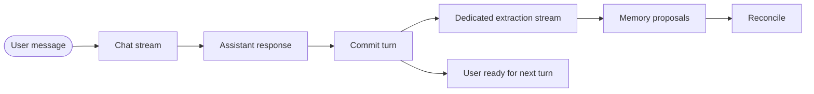
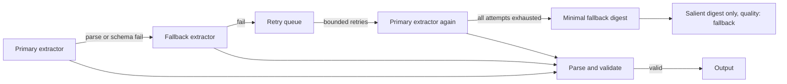
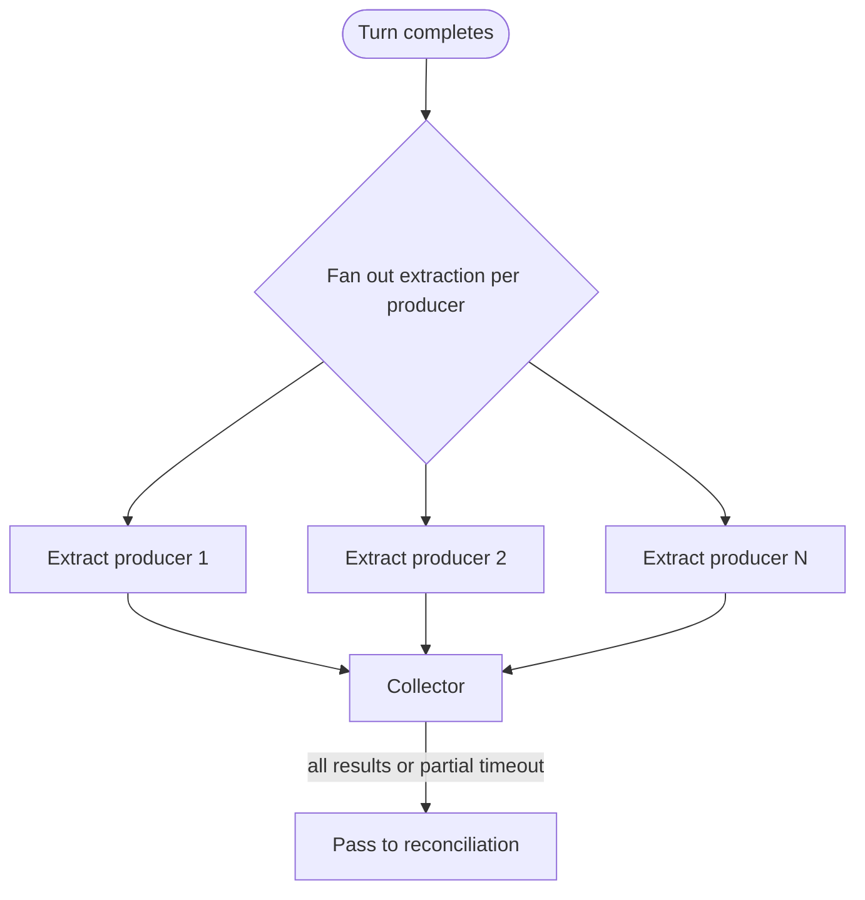

# 06. Extraction

Extraction is the first stage of the [cognitive cycle](05-cognitive-cycle.md). It turns a completed turn into structured memory candidates. This chapter covers the decoupled-stream pattern, the dedicated-extractor pattern, the output contract, and the retry/fallback posture.

> **What this chapter does not include.** The actual extraction prompt used by the reference implementation is not reproduced here. That prompt is the extractor's tuning; it is not architectural. This chapter defines the **contract** the prompt must satisfy — the categories of its output — so that any team can write their own prompt to satisfy it.

---

## The decoupled-stream pattern

Extraction must not block the chat UI. This is non-negotiable.



The chat stream and the extraction stream are independent. The user sees the assistant's response as soon as the chat stream completes. The extraction stream opens after the turn commits and delivers its results asynchronously.

### Why a separate stream rather than a background job

Either can satisfy the latency requirement, but a separate stream has benefits:

- **Streaming progress to the UI.** The Memory Inspector's Activity tab can show extraction in progress per producer, then completion, then reconciliation — all live.
- **Back-pressure visibility.** If extraction falls behind, the UI can represent that honestly.
- **Incremental consumption.** Partial results (for example, one of N producers has finished) can be shown without waiting for the full set.

A plain background job works too. The invariant is: **chat never waits on memory work.**

---

## The dedicated-extractor pattern

Use a model specifically for extraction, separate from the chat assistant(s).

### Why a dedicated extractor

- **Separation of concerns.** The chat assistant is tuned for conversation quality. The extractor is tuned for structured-output fidelity. These are different objectives; combining them degrades both.
- **Cost control.** Extraction can use a smaller, cheaper model than chat. Most extraction does not need frontier reasoning.
- **Quality tuning.** A dedicated prompt can be evolved independently of chat instructions.
- **Determinism.** Extraction should produce consistent structure; chat should produce varied responses. These are opposing temperament settings.

### Practical choice

The production reference implementation uses a dedicated small model for extraction and a fallback model for retries. Specific model identifiers are implementation details; the architectural point is that the extractor is a separate component from the chat assistant(s) and can be configured independently.

In multi-producer extraction (one assistant response per primary model per turn), the **same** extractor processes every producer's response. That keeps the output schema consistent across producers and lets reconciliation compare like-to-like.

---

## Inputs to one extraction run

A single extraction invocation receives:

```typescript
type ExtractionInput = {
  conversationId: string;
  turnNumber: number;
  producerId?: string;     // which assistant produced the response (if multi-producer)
  messages: {
    userMessage: string;
    assistantResponse: string;
  };
  context?: {
    projectType?: string;
    existingConceptLabels?: string[];  // to encourage dedup-friendly output
    activeMetaVault?: string[];
  };
};
```

The context block is a small, bounded nudge toward consistent labeling and deduplication. It is not a transcript dump.

---

## Output contract

Extraction must emit **structured JSON** with the following categories. All fields are required in principle; empty arrays are valid if a category has nothing to contribute for a turn.

```typescript
type ExtractionOutput = {
  salientDigest: {
    decisions: string[];
    facts: string[];
    openQuestions: string[];
    actionItems: string[];
    preferences: string[];     // domain preferences stated in the turn
  };
  proposedEngrams: Array<{
    concept: string;           // 2-5 word label
    content: string;           // fuller body
    confidence: number;        // 0..1
    tags?: string[];
    canonicalConcept?: string; // hint for deduplication
  }>;
  relationships: Array<{
    sourceConcept: string;
    targetConcept: string;
    relationshipType:
      | "depends_on"
      | "contradicts"
      | "supersedes"
      | "prefers_over"
      | "often_relevant_with"
      | string;
  }>;
  metaInsights: Array<{
    concept: string;
    content: string;
    type: "preference" | "style" | "domain_knowledge" | "workspace_convention" | string;
    confidence: number;
  }>;
  extractionQuality: {
    quality: "inboard" | "fallback";
    coverage: "complete" | "partial" | "minimal";
    notes?: string;
  };
};
```

That is the entire contract. **Five top-level keys. No sixth.**

### What each category is for

- **salientDigest** — the compact summary of the turn. Will be stored as a [salient digest asset](04-asset-taxonomy.md#3-salient-digests). **This is the single most important output for context-window management**: the salient digest is what replaces the verbatim turn when activation assembles the next prompt. A well-written salient digest captures the substance of a turn in a fraction of the tokens, which is how the architecture keeps total prompt size bounded as conversations grow. If your digests are bloated, your prompts will be bloated.
- **proposedEngrams** — candidate [engrams](04-asset-taxonomy.md#1-engrams). Each has a concept, content, and confidence. Engrams move durable knowledge **out of the prompt** and into the store, where it can be re-injected selectively on turns that actually need it rather than paid for on every turn. Use `canonicalConcept` as a dedup hint when the extractor recognizes a known concept under a variant phrasing.
- **relationships** — candidate [associations](04-asset-taxonomy.md#2-associations) between the proposed engrams (or between a proposed engram and an existing one). This is Pathway A from [chapter 02](02-conceptual-foundation.md#how-associations-are-created). The usage-driven Pathway B happens later, during activation.
- **metaInsights** — candidate [Meta-Vault entries](04-asset-taxonomy.md#4-meta-vault). These are cross-turn patterns about the user or workspace. They should be rare per turn.
- **extractionQuality** — a self-report of how well extraction went. Used by the [extraction log](04-asset-taxonomy.md#6-extraction-log-optional--operational-telemetry) and for routing fallback retries.

### What is explicitly NOT in the contract

- **No transcript chunk.** The extractor is not a chunker. Raw transcript belongs in conversation storage, not in the extraction output.
- **No vector embeddings.** Embeddings are a storage/indexing concern that the activation engine may use, not an extraction output.

---

## Retry and fallback posture

Extraction will fail sometimes. The pattern:



### Principles

- **Bounded retries.** Retry a bounded number of times with a bounded delay. Unbounded retries are a cost bug.
- **Fallback extractor.** A secondary model, possibly smaller or from a different provider, handles primary failures. This trades marginal quality for availability.
- **Minimal fallback digest.** When all attempts fail, store at minimum a salient digest that just summarizes the turn at a high level. Never leave a turn with zero memory output — that is silently worse than a visible failure.
- **Log everything.** Every attempt, success or failure, is recorded in the [extraction log](04-asset-taxonomy.md#6-extraction-log-optional--operational-telemetry).

### What is tunable

- Retry count (implementation choice)
- Retry delay (implementation choice)
- Primary and fallback extractor identity (implementation choice)
- Minimum acceptable coverage to skip retry (implementation choice)

None of these values are prescribed here. They depend on your latency budget, cost budget, and quality bar.

---

## Multi-producer extraction

In a multi-model chat, extraction fans out to one run per primary producer per turn:



### Collector behavior

- Waits for all producers with a bounded wall-clock timeout.
- If the timeout fires with partial results, merge what arrived and note the missing producers in the extraction log.
- If late results arrive after reconciliation has run, re-finalize (reconciliation modes that support re-finalization should be idempotent).

### When to use multi-producer

Multi-producer extraction is only meaningful when there are actually multiple producers for a single turn — multi-model parallel chat, ensembled single-model calls, or multi-agent conversations that share the same turn scope. For a conventional single-assistant app, extraction runs once per turn and there is no fan-out.

---

## What extraction should NOT do

- **It should not mutate conversation state.** Extraction is read-only on the conversation; it writes only to memory.
- **It should not retrieve.** Activation is a separate stage. Extraction has no business pulling memory into its own context beyond the small context block described above.
- **It should not score or rank.** Reconciliation and activation do that. The extractor assigns confidence to its own proposals; everything else is downstream.
- **It should not decide what becomes durable.** That is reconciliation's job.
- **It should not write to user-facing UI state directly.** Its output flows through reconciliation and storage, then becomes visible via the Memory Inspector.

---

## Pitfalls

- **Running extraction on the chat-model context.** Extraction should see only the user message and the assistant response, not the full chat history. Full history is not needed and increases cost.
- **Letting extraction latency leak into chat UI.** If you find yourself waiting on extraction before rendering, you have regressed to a blocking architecture.
- **Adding output categories ad-hoc.** Every new category is a commitment for reconciliation, storage, and UI. Add new categories deliberately.
- **Producing overlapping engrams in the same run.** The extractor should prefer fewer, better-scoped proposals to many near-duplicates. Reconciliation will dedupe, but cleaner input is cheaper.
- **Producing bloated salient digests.** A digest that is as long as the turn it summarizes is not a digest. Because digests replace verbatim history in downstream prompts, bloated digests directly undermine the architecture's primary purpose (bounded context). Tune extraction toward digests that are dense, structured, and much shorter than the source.

---

## What to read next

- [07-reconciliation.md](07-reconciliation.md) — what happens to extraction output once it arrives
- [04-asset-taxonomy.md](04-asset-taxonomy.md) — the assets the extractor is ultimately producing
- [11-implementation-notes.md](11-implementation-notes.md) — cost and latency trade-offs when choosing extractor models
