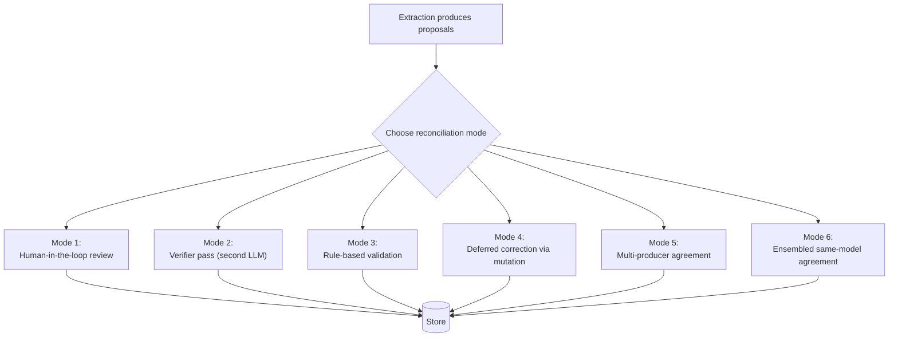
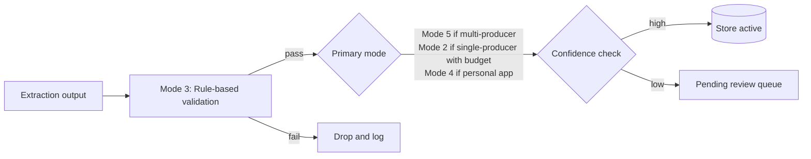

# 07. Reconciliation

Reconciliation is the step between raw extraction output and durable memory. It validates, deduplicates, merges, routes for review, detects contradictions, and decides what becomes active.

The key idea in this chapter — and one of the things that makes this architecture useful beyond multi-model apps — is that **reconciliation is a general pattern with many modes**. Multi-producer consensus is one mode. It is not the default.

> **Key invariant.** Consensus is optional. Reconciliation is not.
>
> An implementation that stores raw extraction output directly, with no organization or review, has no quality floor for what enters memory. That is a hard failure of this architecture.

---

## Why reconciliation exists

Extraction is imperfect. It can:

- propose engrams that duplicate existing memory under a slightly different label
- state a one-off opinion as if it were a durable preference
- miss context that would change the interpretation
- produce contradictions with existing memory without realizing it
- overstate confidence on items the user would not recognize

Reconciliation is the layer that reduces these errors before they shape future prompts.

Reconciliation answers:

1. Is this candidate worth storing at all?
2. Does it duplicate existing memory?
3. Does it contradict existing memory?
4. Should it be active now, or pending review?
5. What provenance should be attached?
6. Who (user, agent, model) should have signed off before it becomes active?

---

## The six reconciliation modes

Modes are **composable** — a production system typically runs rule-based validation as a prefilter (mode 3) then uses one of modes 1, 2, 5, or 6 as the primary reconciliation, then falls back on mode 4 for items that survive but are low-confidence.

---

### Mode 1: Human-in-the-loop review

The user (or another human) approves or rejects each proposed memory before it becomes active.

**When to use it.** High-risk domains (medical, financial, legal). Early product launches. Contexts where wrong memory is costly and manual review is acceptable.

**How it works.** Reconciled proposals go into a `pending` state. The Memory Inspector shows them in a review queue. The user approves, rejects, or edits. Only approved items become `active`.

**What it costs.** User attention. This is the highest-friction mode and has the lowest adoption ceiling.

**What it protects against.** Almost everything. A human reviewer catches duplicates, overstated preferences, context misses, and contradictions.

**Failure mode.** Reviewer fatigue. If the queue grows faster than the user can drain it, memory stops being useful. Mitigation: batch review, auto-approve obvious items via rule-based validation, rank the queue by recency × impact.

---

### Mode 2: Verifier pass (second LLM)

A second model (typically smaller/cheaper than the chat model, possibly the same model as the extractor but with a verifier prompt) critiques each proposed memory and accepts, rejects, or revises it.

**When to use it.** You want a quality gate without adding user friction. You have budget for a second LLM call per turn.

**How it works.** Extraction output → verifier prompt → accept/reject/revise decision per proposal. Accepted items move to storage; rejected items are logged and dropped; revised items either go through another verifier pass or to review.

**What it costs.** One extra LLM call per turn. Some false rejections.

**What it protects against.** Schema-compliant but nonsensical proposals. Overstated confidence. Obvious factual errors the verifier can see but the extractor missed.

**Failure mode.** The verifier adopts the same biases as the extractor, approving bad proposals. Mitigation: use a different model family for the verifier, or prompt it as an adversarial critic.

---

### Mode 3: Rule-based validation

Deterministic checks applied before any model-based reasoning.

**When to use it.** Always, as a prefilter. There is no downside to catching obvious issues cheaply.

**How it works.** A rule engine or validator checks each proposal against a set of deterministic rules:

- Schema conformance
- Minimum/maximum content length
- Concept label format (for example, 2–5 words; no profanity)
- No empty required fields
- Scope consistency (a workspace-scoped engram cannot claim user-scoped provenance)
- No exact duplicates of existing concept labels

Proposals that fail rule checks are rejected or routed to a fix-up step.

**What it costs.** Rule maintenance.

**What it protects against.** Malformed output. Obvious junk. The kinds of errors that are cheap to catch and embarrassing to store.

**Failure mode.** Over-strict rules reject useful memory. Mitigation: keep rule thresholds deliberately permissive; reserve strictness for multi-model or verifier modes downstream.

---

### Mode 4: Deferred correction via mutation

Store proposals with minimal validation; rely on the user to correct memory over time via the mutation surface.

**When to use it.** Personal, low-risk chat apps where friction matters more than precision. Products that lean heavily on [chapter 10](10-transparency-mutability.md) transparency/mutability.

**How it works.** Proposals are schema-validated, dedup-checked, and stored with a `state: active` and a `confidence` slightly reduced to reflect lack of further review. The user sees them in the Memory Inspector and edits/deletes/suppresses as needed.

**What it costs.** Occasional wrong memory in early use. Degraded prompt quality until the user has corrected things.

**What it protects against.** Friction. This is the mode most users will accept for a personal chat app.

**Failure mode.** Users never correct anything, and wrong memory accumulates. Mitigation: periodic prompts to review recently-added memory; a decay rule that lowers utility on un-activated items.

---

### Mode 5: Multi-producer agreement

Multiple independent producers (for example, multiple LLMs responding to the same turn in parallel) each produce extraction proposals. Reconciliation groups similar proposals across producers, picks a representative, tracks agreement ratio, and detects contradictions.

**When to use it.** Multi-model parallel chat. Multi-agent systems where agents have distinct perspectives. Environments where independent agreement is a meaningful quality signal.

**How it works (in general terms):**

1. Collect proposals from all producers.
2. Group proposals across producers by concept similarity (implementation choice: token overlap, canonical concept match, embedding similarity, or hybrid).
3. For each group, pick a representative proposal (implementation choice: highest confidence, longest content, most-recent producer).
4. Compute agreement ratio = number of producers in the group / total producers.
5. Apply a confidence adjustment based on agreement (higher agreement → higher confidence).
6. Detect contradictions: proposals with highly-similar concept labels but semantically opposed content.
7. Emit a [consensus report](04-asset-taxonomy.md#5-consensus-reports-optional--only-when-reconciliation-produces-multiple-proposals) summarizing the merge.

**What it costs.** The overhead of running N extractions. Added complexity in reconciliation. The need to handle partial results when some producers fail.

**What it protects against.** Single-model biases. Hallucinated "facts" that no other producer proposed. Overstated confidence where only one producer asserts something.

**Failure mode.** All producers share the same bias (same model family, similar prompts) and agreement becomes meaningless. Mitigation: use producers with meaningful independence (different model families, different prompts, different temperatures).

> **Important.** Agreement is a **signal**, not a **guarantee**. Two producers agreeing on a wrong proposal is still a wrong proposal. This mode reduces random error; it does not eliminate systematic error.

---

### Mode 6: Ensembled same-model agreement

The same extractor is called multiple times (often with varied temperature or varied prompts) on the same input, and the results are merged as if they came from independent producers.

**When to use it.** Single-model apps that want multi-producer reconciliation's robustness benefits without running multiple chat models.

**How it works.** Call the extractor N times (implementation choice for N). Apply mode 5 merging to the N results.

**What it costs.** N times the extraction cost per turn.

**What it protects against.** Random noise in a single extraction run. Temperature-induced variation. Low-confidence proposals that a single run asserts confidently.

**Failure mode.** Ensembling the same model introduces less independence than using different models. It does not protect against systematic biases in the model or prompt.

---

## Composability: a typical production stack

Most production systems use a composition rather than a single mode:

This stack combines:

- rule-based validation as a cheap prefilter (mode 3)
- a primary mode chosen by product type (mode 2, 4, or 5)
- a review queue for low-confidence items that survive (effectively mode 1 for the tail)

---

## Grouping proposals (for modes 5 and 6)

When reconciliation needs to merge multiple proposals, it must decide which proposals are "about the same thing." The pattern:

1. **Normalize** concept labels (lowercase, strip punctuation).
2. **Compute similarity** between normalized labels and between content bodies. Similarity can be token-overlap (Jaccard/cosine on tokens), embedding similarity, or a rule-driven combination.
3. **Group** proposals whose combined similarity exceeds a threshold.
4. **Pick a representative** per group using a tie-break (highest confidence, longest content, specific producer priority).
5. **Record provenance** for every proposal in the group, not just the representative.

The threshold value is an implementation choice. A lower threshold aggressively merges (fewer duplicates, more risk of merging distinct concepts); a higher threshold conservatively keeps things apart (fewer accidental merges, more duplicates that reconciliation did not catch).

This architecture does not publish a specific threshold. Choose one appropriate to your domain; monitor it; adjust.

---

## Contradictions

Contradictions are not errors. They are information.

When two proposals have high concept similarity but low content similarity — or when a new proposal asserts something that actively opposes existing memory — reconciliation should:

- **preserve both** (do not silently overwrite the old)
- **mark the relationship** as `contradicts` (this is an [association](04-asset-taxonomy.md#2-associations) with a specific relationship type)
- **lower confidence** on both until disambiguated
- **route to review** so the user can decide

A `contradicts` edge is visible in the Memory Inspector. Users appreciate seeing that the system is honest about its uncertainty.

---

## Confidence and agreement

Confidence in this architecture is not a mystical single number. It is a visible signal with explainable contributors:

- **Extraction confidence** — the extractor's own self-report, from the extraction contract.
- **Agreement confidence** — when mode 5 or 6 is used, how many independent producers proposed it.
- **User confidence** — did the user approve, edit, or pin this item?
- **Usage confidence** — has this item been activated and proven useful?

Expose these contributors in the Memory Inspector rather than hiding them behind a single score. Users trust confidence they can understand.

---

## Approval policies by product risk

Different product contexts justify different default reconciliation postures.

**Low-risk personal assistant (default mode 4 + occasional mode 1):**

- Auto-store narrow project facts.
- Queue broad user-profile claims for review.
- Let users edit or delete everything.

**Team workspace (default mode 3 + mode 5 if multi-agent, else mode 2):**

- Auto-store conversation-scoped facts.
- Require approval for workspace-wide memory.
- Track who approved or edited memory.

**High-risk domain (default mode 1):**

- Keep all extracted memory `pending` by default.
- Require explicit approval before activation.
- Maintain a detailed audit trail.

These are starting defaults. Your product will tune them.

---

## What to avoid

- **Treating model output as durable truth without review.** Even frontier models hallucinate structured-output fields.
- **Merging concepts only by string equality.** Real-world duplicates have varied phrasing.
- **Discarding conflicts without a record.** A `contradicts` edge is more useful than a silent overwrite.
- **Hiding confidence behind a single number.** Make the contributors visible.
- **Skipping reconciliation entirely.** Choose a mode. Even mode 4 is still a mode.
- **Letting memory become active when the user has suppressed it.** Suppression is absolute; it applies regardless of what reconciliation produces.

---

## What to read next

- [04-asset-taxonomy.md](04-asset-taxonomy.md#5-consensus-reports-optional--only-when-reconciliation-produces-multiple-proposals) — the consensus report asset that records multi-producer merges
- [10-transparency-mutability.md](10-transparency-mutability.md) — how reconciliation decisions are exposed to the user
- [11-implementation-notes.md](11-implementation-notes.md) — tuning thresholds, managing the review queue, cost trade-offs

---

## Academic references

Three classical sources ground the core reconciliation mechanics. For the broader bibliography, see the [README's Academic references section](../README.md#academic-references).

- **Fellegi, I. P., & Sunter, A. B. (1969).** A Theory for Record Linkage. *Journal of the American Statistical Association,* 64(328), 1183–1210. DOI: [10.1080/01621459.1969.10501049](https://doi.org/10.1080/01621459.1969.10501049). — *Foundational theory for the deduplication / "grouping proposals" step (normalize, compute similarity, group above threshold, pick representative).*
- **Condorcet, M. de. (1785).** *Essai sur l'application de l'analyse à la probabilité des décisions rendues à la pluralité des voix.* Paris: Imprimerie Royale. — *Condorcet's Jury Theorem: if each independent producer is more likely than chance to be correct, majority agreement across producers is more likely still to be correct. The probabilistic basis for Mode 5 (multi-producer agreement) — and for the caveat that shared bias collapses the theorem's independence assumption.*
- **Dietterich, T. G. (2000).** Ensemble methods in machine learning. In *Multiple Classifier Systems* (Lecture Notes in Computer Science, Vol. 1857, pp. 1–15). Springer. DOI: [10.1007/3-540-45014-9_1](https://doi.org/10.1007/3-540-45014-9_1). — *Modern formalization of ensembling over diverse producers; grounds Mode 6 (ensembled same-model agreement) and clarifies why ensembling the same model yields weaker gains than ensembling diverse models.*
