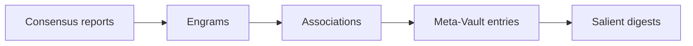

# 08. Storage

This chapter covers where memory lives and how it moves between stores. The architecture is storage-agnostic — the decisions that matter are local-first priority, provenance preservation, scoping, and (when applicable) sync.

> **Implementation note.** The reference implementation uses **IndexedDB (via Dexie)** as the primary browser-side store and **Postgres** as an optional cloud mirror. Neither is architectural. Choose what fits your stack. This chapter describes patterns, not technologies.

---

## Why a persistent store at all

Before local-first, understand why a dedicated store exists.

The cognitive layer's primary purpose — keeping context-window usage bounded regardless of conversation length — requires that memory live **outside the prompt**. If memory lived only in the prompt (as stacked turns), the prompt would grow without limit and the whole architecture would collapse into "use a bigger context window," which is what we are specifically avoiding.

The store is the externalization. Every engram, association, salient digest, and Meta-Vault entry persisted to the store is content that **does not have to be paid for on every turn**. It sits in storage at rest, and is brought back into the prompt only when activation selects it. That is how a conversation at turn 200 can send the same-size prompt as a conversation at turn 10 — the conversation's accumulated knowledge lives in the store, not in the prompt.

From that vantage, every decision in this chapter (local-first priority, scoping, activity logging, sync) is in service of the same goal: a durable, trustworthy place for memory to live outside the prompt so that activation has something compact to select from.

## Local-first principle

The primary memory store should live **close to the user**: in the browser, on their device, or in their personal workspace. The cloud is a mirror, not a source of truth.

### Why local-first

- **Privacy.** Memory that never leaves the device cannot be leaked by the server.
- **Offline use.** Chat that works offline needs memory that works offline.
- **User ownership.** Local-first makes export, deletion, and migration concrete rather than abstract.
- **Performance.** Activation runs inline in the chat path. A local store is usually lower-latency than a network round-trip — which matters because the activation pass is what enforces the context-window budget, and anything that slows activation eats into the chat latency budget.

### What local-first does NOT mean

- It does not mean "no server involvement." Extraction may still call server-side LLMs. Sync may mirror to a server. Some users store memory server-side for account portability. Local-first is a default, not a dogma.
- It does not mean the primary store must be the browser. A desktop app's SQLite file, a mobile app's on-device database, or a personal cloud instance all satisfy local-first.
- It does not mean "no cloud sync." Optional sync is explicitly supported.

### The invariant

The user should be able to use the chat app, with full memory functionality, without any network call that leaves their device — except for the LLM calls themselves. Memory state must not be stranded on a server.

---

## What the store must hold

For every memory asset, the store must preserve:

- the current content
- the current state
- all provenance fields
- edit history sufficient to explain changes to the user
- activation history sufficient to support reinforcement and auditing

The asset schemas in [chapter 04](04-asset-taxonomy.md) are the logical shape. Your physical schema can denormalize, index, or partition as needed.

---

## Scope and vaults

Every memory object has a **scope**. Scopes prevent leakage between contexts that should stay separate.

### Standard scopes

- **User scope.** Applies across all conversations and workspaces for one user.
- **Workspace scope.** Applies within a workspace (team, project collection).
- **Project scope.** Applies within one project inside a workspace.
- **Conversation scope.** Applies only within one conversation.

### Vaults

A **vault** is a scope-isolated partition of the store. The simplest useful abstraction: one vault per user. In team products, one vault per user plus a separate vault per workspace.

Vaults enforce:

- **Isolation.** Queries against one vault cannot see another vault's memory.
- **Auth boundaries.** Vault access is gated by the user's (or team's) auth.
- **Export granularity.** A user can export their personal vault without leaking workspace data, and vice versa.
- **Deletion boundaries.** "Delete my data" deletes one vault, not others.

### Cross-scope relationships

Associations between engrams in different scopes are a design question. The safe default: **associations stay within a scope.** Cross-scope edges require deliberate design work to avoid leakage (for example, a workspace-scoped engram that is `depends_on` a user-scoped engram means the workspace can now indirectly learn the user's personal preference — maybe acceptable, maybe not).

### Cross-conversation continuity

The reference implementation stores every engram and association with `scope` plus `scopeId`, indexed as `(scope, scope_id)` and `(scope, scope_id, state)`. Activation builds a scope chain from the current conversation, optional project, optional workspace, and authenticated user id, then queries each scope and merges candidates before scoring. Conversation-scoped rows are the default write target; promotion moves high-utility or repeated-memory rows to project/workspace scope as `pending` so the user can approve cross-conversation reuse.

When cloud sync is enabled, push batches include `scope`, `scope_id`, and `promotion_history`. Pull uses a bounded scope-chain endpoint that returns only rows matching the caller's scope filters, preserving the same leakage boundary in Postgres that local activation enforces in IndexedDB.

---

## Activity and audit history

Alongside the asset records, the store should hold an **activity timeline**:

- extraction events (success, failure, retry)
- reconciliation events (what was merged, what was rejected)
- activation events (what was injected, when, into which turn)
- mutation events (what the user edited, deleted, pinned, suppressed)
- sync events (what was pushed, pulled, resolved)

Activity history is what powers the Memory Inspector's Activity tab ([chapter 10](10-transparency-mutability.md)). Without it, transparency is limited to "here is what exists now" with no "here is how it got that way."

This is append-only. Retention can be capped (oldest events age out), but nothing in the active window is edited after the fact.

---

## Optional cloud sync

When the product wants memory to follow the user across devices, a cloud mirror is the standard pattern.

### Principles

- **Local stays primary.** The cloud is a mirror. If the cloud is unreachable, memory must still work locally.
- **Sync is explicit.** The user should be able to see what was synced, when, and what data is in the cloud.
- **Sync is idempotent.** Retrying a sync batch produces the same result.
- **Sync respects edits.** A user edit on device A must not be clobbered by a stale cloud copy.

### Sync batch structure

A sync batch is a bounded set of recent changes, exported from the local store and applied to the cloud mirror (or vice versa).

```typescript
type SyncBatch = {
  vaultId: string;
  exportedAt: string;
  upserts: {
    consensusReports: ConsensusReport[];
    engrams: Engram[];
    associations: Association[];
    metaVaultEntries: MetaVaultEntry[];
    salientDigests: SalientDigest[];
  };
  deletions: {
    engrams: string[];
    associations: string[];
    metaVaultEntries: string[];
    salientDigests: string[];
  };
  activityEvents?: ActivityEvent[];
};
```

### Sync order

When applying a batch, order matters so that foreign-key-like references resolve:




This order reflects the dependencies: associations reference engrams; consensus reports reference engrams; salient digests stand alone but are applied last because they are typically the largest and least urgent.

The reference implementation applies batches in this order. Your specific dependencies may differ; the pattern is: apply referenced entities before their referrers.

### Conflict resolution

Conflicts arise when the same asset changes locally and remotely between syncs. The default strategy:

- **User edits win over automated changes**, regardless of timestamp.
- **Newer automated edits** beat older automated edits.
- **Conflicting user edits** (the same item edited on two devices before sync) surface to the user for manual resolution rather than being silently merged.

### Sync frequency

- **Opportunistic.** Sync when the app comes online or enters a foreground state.
- **Bounded batches.** Never send an unbounded batch. Cap at some reasonable count per sync to avoid timeouts on large stores.
- **User-controllable.** The user should be able to trigger a sync manually, and to pause sync.

---

## Retention, archiving, and cold storage

Memory grows. A long-running chat app will accumulate thousands of engrams per user. Retention policy is a product decision, but the store must support these operations:

- **Archive.** Move an asset to a lower-priority tier. Excluded from normal activation but retained for inspection.
- **Suppress.** Retain but never inject. Different from archive because the user explicitly chose this.
- **Soft delete.** Move to a deleted tier with a retention window before hard deletion.
- **Hard delete.** Remove from the store entirely. This is what "delete my data" triggers.

Cold storage (for example, moving very old salient digests to a cheaper tier) is an implementation optimization, not an architectural requirement.

### Decay and forgetting

Memory that is never used must fade. Otherwise a long-running vault
accumulates weakly-relevant engrams that bloat every activation pass and
inflate the token budget required to cover the long tail. The store must
support two decay operations:

- **Auto-archival sweep** for engrams that have been unused for a long
  window, have low utility, and are not user-pinned. These transition to
  `state: 'archived'` and are excluded from normal activation (but remain
  inspectable and explicitly restorable).
- **Association weight decay** for edges that have not been co-activated
  recently. Weights multiply by a per-week decay factor until they hit a
  floor; once below a dormancy threshold, the weight is pinned at the
  floor and the edge contributes no meaningful Hebbian boost.

Two invariants on the decay pass:

1. **User pins are immune.** Pinned engrams never auto-archive.
2. **Semantic edges are immune.** Associations with relationship types
   `contradicts` or `supersedes` never decay — their semantic meaning is
   preserved indefinitely because their _existence_ is more informative
   than their _weight_.

> **Reference implementation (Phase A.4).** `MaintenanceSweeper.ts`
> implements both operations. Defaults: archive after 60 days of inactivity
> with utility < 0.3 and access_count ≤ 0; association weight decays by a
> factor of 0.98 per week after 30 days of inactivity with a floor of 0.05;
> any edge whose decayed weight would drop below 0.1 is pinned at the floor
> (dormant). The sweep is throttled to once per 24 hours via a
> `localStorage` timestamp; private-mode browsers fall back to an
> in-memory per-session dedupe so the sweep still runs at most once per
> session. Sweep completions surface in the Memory Inspector Activity tab
> so users can observe the system "forget" over time.

### Sensitive data filtering

The store's persistence boundary is the last line of defense against
letting credentials, medical details, or financial identifiers leak into
a long-lived memory that later gets injected into every assistant prompt.
Two policies run **before** any proposed engram reaches the store:

1. **auto_redact** — regex-detects high-confidence patterns (credit cards
   with a Luhn check, SSNs, JWTs, common API-key prefixes, AWS access
   keys, bearer tokens) and replaces matches with `[REDACTED:type]`
   markers. Redaction metadata (`types`, `count`) is persisted on the
   engram.
2. **flag_for_review** — tags engrams whose category is health or finance,
   or whose content matches medical/financial keywords, as pending review.
   Flagged engrams land in `state: 'pending'` and are surfaced via the
   Pending tab in the Memory Inspector (chapter 10). The user must
   explicitly approve or reject them before they participate in
   activation.

Both policies are auditable: redaction counts and types are persisted per
extraction log entry, and every flagged engram retains its
`redactionApplied` metadata for inspection after the fact.

> **Reference implementation (Phase A.8).**
> `backend/src/services/collabmem/SensitiveDataFilter.ts` implements both
> policies as pure functions. `InboardExtractionService.extract` applies
> them to every `ProposedEngramV2` returned by the inboard LLM before
> `ConsensusEngine.merge` runs. The filter is intentionally optimistic
> (reduce false negatives over false positives): credit-card-shaped digit
> runs are Luhn-validated before redaction to avoid eating timestamps or
> phone numbers, but keyword-based review flagging errs on the side of
> routing borderline cases through the Pending queue. Redaction counters
> are logged to `mem_extraction_log.redaction_count`,
> `mem_extraction_log.redaction_types`, and
> `mem_extraction_log.flagged_for_review_count`.

---

## Storage technology choices

Any of these can implement the store. Pick what fits.


| Technology          | Best fit                                      | Trade-offs                                     |
| ------------------- | --------------------------------------------- | ---------------------------------------------- |
| IndexedDB (Dexie)   | Browser-based personal chat apps              | Size limits; browser quota; no server presence |
| SQLite              | Desktop apps, local-first mobile              | Single-file; easy export; limited concurrency  |
| Postgres            | Server-mirrored or server-primary deployments | Network-dependent; excellent query power       |
| Document store      | Flexible schemas, rapid iteration             | Relational query power varies by engine        |
| Graph store         | Heavy association query workloads             | More operational complexity                    |
| Vector index        | Embedding-based similarity in activation      | Not a store; a companion to one of the above   |
| Hybrid (multi-tier) | Large-scale products; specialized subsystems  | Most complex; best performance ceiling         |


The activation engine ([chapter 09](09-retrieval-activation.md)) can layer vector similarity on top of any of these, or operate without embeddings at all.

---

## Export and import

Users should be able to **export** their memory as a portable bundle. This is important for:

- **Ownership.** The user can take their memory elsewhere.
- **Migration.** Moving between devices, accounts, or products.
- **Backup.** Local-first systems are vulnerable to device loss without export.

A portable export is a JSON (or compressed JSON) bundle matching the asset schemas in [chapter 04](04-asset-taxonomy.md) plus the activity log. The import side is a sync batch applied to an empty vault.

---

## What the store should NOT do

- **Store unencrypted secrets.** The store holds memory, not credentials.
- **Embed arbitrary attachments.** Binary attachments belong in object storage with a reference from memory records.
- **Enforce activation logic.** Activation is the activation engine's job. The store's job is efficient retrieval of typed records.
- **Compress silently.** Compression at the storage layer is fine, but lossy transformation is not — memory content should round-trip.
- **Fabricate provenance.** If a record lacks provenance, mark it so. Do not backfill plausible-looking source metadata.

---

## What to read next

- [09-retrieval-activation.md](09-retrieval-activation.md) — how stored memory is scored and brought back into prompts
- [10-transparency-mutability.md](10-transparency-mutability.md) — how the store surfaces to the user
- [11-implementation-notes.md](11-implementation-notes.md) — storage technology trade-offs in more depth

