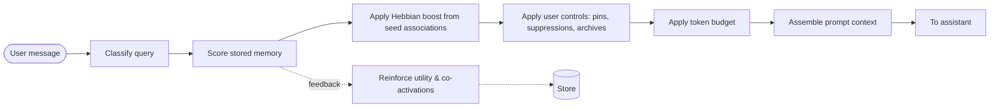
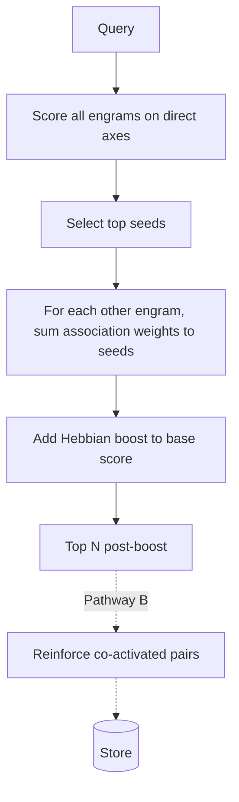
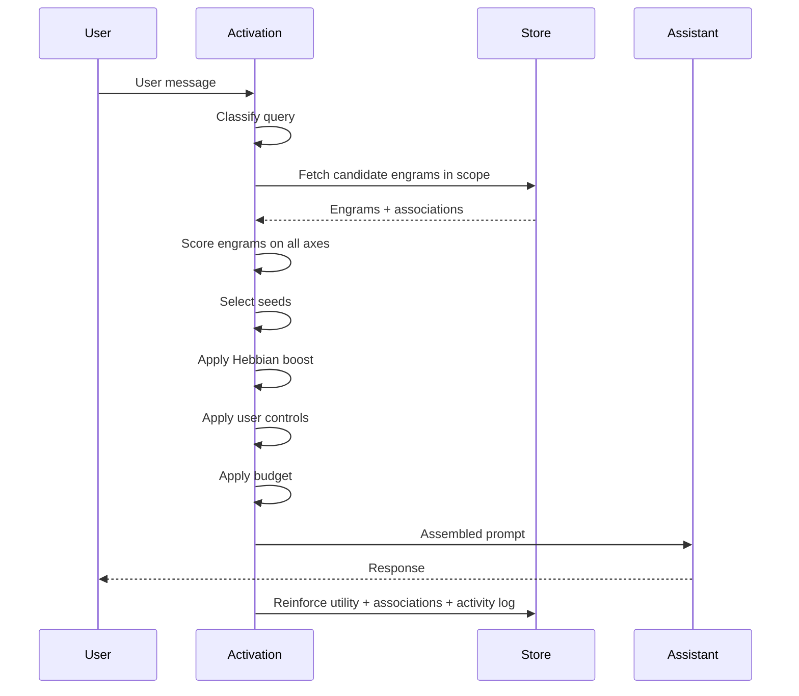

# 09. Retrieval and Activation

Activation is the return path of the [cognitive cycle](05-cognitive-cycle.md). On each new turn, before the assistant receives the assembled prompt, the activation engine chooses which memory matters, pulls it back into context, and (as a side effect) reinforces what it touches.

This chapter describes the activation pass, the scoring axes, the Hebbian boost from associations, token budgeting, and the feedback loop back to storage.

> **Why this chapter matters most.** Activation is where the cognitive layer's primary purpose — keeping context-window usage bounded — is actually enforced. Every earlier chapter (extraction, reconciliation, storage) exists so that activation has something compact, typed, and reliable to select from. If activation regresses to "stuff the prompt with everything," the rest of the architecture is wasted. Treat this chapter's token-budgeting section as the operational centerpiece of the whole system.

> **Terminology note.** The biological word for "bringing memory back" is **activation**, not retrieval. Retrieval suggests a passive lookup. Activation suggests that the act of using memory also changes its state. Both terms appear throughout this doc; they refer to the same step.

---

## Where activation sits in the flow

Activation runs **synchronously** in the chat path. Its latency budget is tight. Everything else about the cognitive layer is asynchronous; activation cannot be.

---

## 1. Query classification

Not all user turns have the same activation needs.

### Query types

A simple but effective classification:

- **Temporal.** The user is asking about a specific time window ("what did we decide yesterday", "what was the plan last week"). Recency and temporal fit matter most; lexical match matters less.
- **Factual.** The user is asking about a specific fact or artifact ("what version of postgres did we choose"). Lexical match and utility matter most.
- **Associative.** The user is exploring or connecting ideas ("how does this relate to our earlier deployment work"). Hebbian boost from seeds matters most.
- **General.** Anything else. Balanced weighting across axes.

### How to classify

Classification can be:

- **Pattern-based.** Regex or keyword matching against temporal phrases ("yesterday", "last week", "N days ago"), factual patterns ("what is", "what version"), associative cues ("how does X relate to").
- **Model-based.** A small fast classifier model.
- **Hybrid.** Pattern match first, fall back to model classification when patterns don't fire.

The production reference implementation uses pattern-based classification with specific regex sets. The patterns are tuning, not architecture.

### What classification affects

Classification adjusts the **weights** applied to scoring axes (see next section). It does not change which axes exist, and it does not bypass any axis.

---

## 2. Scoring axes

Every active engram is scored on multiple axes. The final score is a weighted combination.

> **What this chapter does not publish.** The reference implementation uses specific weights per query type, tuned to the product. Those exact weights are not architectural. This chapter lists the axes and what each contributes. Choose and tune weights for your domain.

### The axes

| Axis                | What it measures                                                           | Why it matters                                                |
| ------------------- | -------------------------------------------------------------------------- | ------------------------------------------------------------- |
| Text match          | Lexical/token-level overlap between the query and the engram concept/content | Cheap, direct relevance                                       |
| Recency             | How recently the engram was created or updated                             | Recent items are more likely still true                       |
| Temporal proximity  | How well the engram's timestamp matches a temporal phrase in the query     | Satisfies explicit temporal questions                         |
| Utility             | The engram's learned usefulness score                                      | Items that have helped before are likely to help again         |
| Confidence          | How sure the system is this memory is accurate                             | Avoids surfacing low-confidence items for high-stakes queries |
| Hebbian boost       | Summed weight of associations connecting this engram to top seed engrams   | Brings in relevant neighbors via the association graph        |
| Scope match         | Match between the engram's scope and the current conversation/workspace    | Prevents cross-scope leakage                                  |
| User priority       | Pins and explicit user priority overrides                                  | Always honored                                                |

### Semantic (embedding) similarity

Vector similarity on embeddings can be added as an additional axis when the product justifies the infrastructure cost. It is **not required** by this architecture. The text-match axis can handle short concept labels and content bodies without vector infrastructure for many products.

When used, embedding similarity is one axis among the others, not a replacement for them.

### A note on "author reputation"

All stored memory carries equal structural weight regardless of which producer proposed it. Differences in trust come from confidence, utility, and provenance — not from any producer-level weighting.

---

## 3. Seed selection and Hebbian boost

The activation pass has two logical phases:

1. **Direct scoring.** Every active engram gets a base score from the non-boost axes above.
2. **Seeded boost.** A small number of top-scoring engrams become **seeds**. For every other engram, the pass looks at associations connecting it to any seed, sums their weights, and adds that sum to the engram's score as a Hebbian boost.

### Why seeds

Seeds give the boost a grounded starting point. Without seeds, Hebbian boost has no anchor — every pairwise boost would be local. Seeds concentrate boost around the engrams most directly relevant to the query.

### Seed count

The number of seeds is an implementation choice. Too few: boost is too local. Too many: boost dominates, and less-relevant neighbors start outweighing more-directly-relevant engrams. The production reference implementation uses a small fixed count; tune to your domain.

### Pathway B reinforcement

The seeded boost is also the moment when Pathway B association strengthening happens. Among the top N scored engrams (post-boost), every pair that was co-activated in this turn has its association weight nudged upward and its co-activation counter incremented. This is how associations emerge from use alone.

---

## 4. User controls

User controls are applied **after** scoring and boost, **before** budgeting. They are absolute.

- **Pins.** A pinned engram bypasses the relevance floor and is included regardless of score.
- **Suppressions.** A suppressed engram is excluded from activation entirely, regardless of score. This is not "reduce priority" — it is never-inject.
- **Archives.** Archived engrams are excluded from normal activation but can be surfaced by explicit search.
- **Scope filters.** Cross-scope engrams are excluded unless the product explicitly allows cross-scope activation.

User controls are not soft signals. A user who suppressed something means it.

---

## 5. Token budgeting

This is the mechanism that keeps context-window usage bounded. It is not an optimization or a safety net — it is the whole point of the chapter.

### The goal

At every turn, the assembled prompt sent to the assistant should have a **total size that sits well below the model's maximum context window** and does **not grow with conversation length**. A conversation at turn 200 should send a prompt that is approximately the same size as the same conversation at turn 10 — with a different selection of memory, but not a larger total.

Stated as invariants:

- the prompt has a **hard ceiling** chosen by the product, not by the model
- the ceiling is **much lower** than the model's advertised context limit (typical targets: 20%–50% of the model's window, depending on product needs)
- the ceiling does not change with conversation length
- if activation cannot produce a good prompt within the ceiling, it lowers the relevance floor and trims more aggressively — it does not raise the ceiling

### Why the ceiling is much lower than the model's limit

Giving the model a prompt at or near its maximum context has four compounding costs that were called out in the [README's context-window problem section](../README.md#the-context-window-problem): rising cost per turn, attention dilution, lost-in-the-middle, and the hard ceiling itself. The cognitive layer exists to avoid all four. A lower, stable ceiling delivers:

- **predictable cost per turn** regardless of conversation length
- **focused attention** on a small, relevant selection
- **no lost-in-the-middle** because the prompt is short enough for the model to attend uniformly
- **no truncation crisis** because the conversation cannot push the prompt over the limit

### Budget shape

The total budget is divided across sections:

- **Static instructions.** System-level instructions. Usually small and fixed.
- **Meta-Vault section.** Durable cross-conversation patterns that are scope-relevant.
- **Engrams section.** Relevant memory units activated for this turn.
- **Salient history section.** Recent salient digests — **this is the section that replaces verbatim turn stacking**. Digests are compact summaries of prior turns, produced in extraction. This is where the architecture earns its context-window savings.
- **Verbatim recent turns section.** The last one or two raw turns, if your product wants the freshest context word-for-word. Keep this section deliberately small.
- **Current user message.** The incoming turn.
- **Tool/attachment context.** If applicable.

The relative sizes reflect product trade-offs: more engrams for deep knowledge, more salient digests for thread continuity, more verbatim for freshness. The reference implementation uses specific ratios tuned to its chat experience; those ratios are not published here because they depend on your product.

### Replacing verbatim history with salient digests

The single largest context-window saving this architecture produces comes from **not sending verbatim turn history**. In a naive chat app, each prior turn consumes its full original token count every time it is included. Dozens of turns into a conversation, that dominates the prompt.

This architecture substitutes **salient digests** (produced during [extraction](06-extraction.md)) for most of that history. A salient digest of a turn is typically a small fraction of the turn's original token count but preserves the substance (decisions, facts, open questions, action items). The prompt's "recent history" section is therefore built from digests, not raw turns, and can cover many more turns of context in the same token budget.

This is what lets a 200-turn conversation fit in the same-size prompt as a 10-turn conversation.

### Trimming order

When a section overflows its slice of the budget, trim greedily from the lowest-scoring items. Never randomly truncate text — trim at the asset boundary so every item included is complete.

### Relevance floor

Set a minimum score below which engrams are excluded entirely, even if budget remains. A weakly-relevant engram is worse than no engram — it dilutes context and works against the bounded-context purpose.

### What to do when good memory is available but the budget is full

Two options, both acceptable:

- **Strict budget.** Drop the lowest-scoring items already included to make room. The ceiling is never violated.
- **Elastic budget (small elasticity only).** Allow a small elasticity (say, 10–20%) for rare high-value items that would otherwise be dropped. Never allow unbounded elasticity; the hard ceiling must remain.

What you must **not** do: raise the ceiling because the conversation has grown. That is the failure mode the architecture exists to prevent.

---

## 6. Prompt assembly

Assembled memory context is injected into the assistant's prompt as a clearly-labeled section, separate from:

- static system instructions
- recent conversation history
- the current user message
- tool or attachment context (if applicable)

The assembled section should be structured for the assistant to parse reliably. The production implementation uses a specific format; any consistent format works. What matters is:

- **Clear separation** between memory context and other prompt sections
- **Identifiable units** so the assistant can refer to specific memories if it wants to
- **No leakage** of internal identifiers, debug strings, or proprietary tokens

The [Payload Inspector](10-transparency-mutability.md) surfaces exactly what was assembled so users and developers can audit it.

---

## 7. The feedback loop

Activation does not end when the prompt goes to the assistant. The act of activation is itself data.

### What activation records

Every activation pass should record:

- which engrams were scored
- which engrams were selected for the prompt
- why they were selected (in plain language, derived from the axes)
- approximate size of the memory section
- which user controls fired (pins included, suppressions excluded)

This feeds the [activity timeline](08-storage.md#activity-and-audit-history) and is surfaced in the Memory Inspector.

### Reinforcement

The next turn completes. Reinforcement now runs:

- Engrams that were activated and appear to have contributed to a useful turn get their **utility score** nudged up.
- Engrams that were activated but never seem to help get theirs nudged down.
- Co-activated pairs get association **weight** nudged and **co-activation counter** incremented (Pathway B).
- User actions on memory — pin, edit, suppress, approve — act as **strong explicit signals** that override implicit reinforcement.

"Appears to have contributed" is a soft signal. Options for approximating it:

- The user did not immediately correct or edit the assistant's response
- The user continued the thread rather than restarting
- The user explicitly approved or pinned memory after the response
- An explicit feedback widget ("was this helpful?")

None of these are clean signals. Use them with bounded effect, and lean on explicit user feedback as the strongest signal.

### Decay

Un-activated memory should **decay** slowly in utility. Not deletion — just lower utility, which reduces the probability of future activation. Decay prevents the store from being dominated by old, irrelevant items that were useful once.

Decay rate is an implementation choice. A gentle linear decay over weeks is a reasonable default.

---

## 8. Full activation pass — sequence

---

## 9. Failure modes and how to recognize them

| Symptom                                          | Likely cause                                   | Mitigation                                     |
| ------------------------------------------------ | ---------------------------------------------- | ---------------------------------------------- |
| Memory feels irrelevant                          | Scoring weights are off for the query type     | Enable query classification; tune per type     |
| Assistant repeats itself across turns            | Activation returning the same items every turn | Add utility decay; boost recency               |
| Answers ignore obvious prior knowledge           | Relevance floor too high; budget too tight     | Lower the floor; increase engram budget slice  |
| Answers are cluttered with weakly related items  | Relevance floor too low; budget too loose      | Raise the floor; trim more aggressively        |
| New memory takes forever to influence answers    | Seed selection never reaches new engrams       | Boost recency; include user-pinned explicitly  |
| Suppressed memory still leaks into prompts       | User controls applied in wrong order           | Apply suppressions last, as an absolute filter |
| Activation latency affects chat responsiveness   | Over-complex scoring; too many candidates      | Pre-index by scope; prune candidates before scoring |
| Prompt size grows with conversation length       | Verbatim history is being stacked; digests not replacing it; ceiling is soft | Enforce the ceiling as hard; verify salient digests are actually replacing verbatim turns; monitor prompt size over conversation length and flag regressions |
| Cost per turn rises over the life of a conversation | Same root cause — unbounded prompt growth   | Same mitigation; treat stable prompt size as a production SLO          |

---

## What to read next

- [07-reconciliation.md](07-reconciliation.md) — how memory got into the state activation acts on
- [10-transparency-mutability.md](10-transparency-mutability.md) — how the Payload Inspector exposes what activation produced
- [11-implementation-notes.md](11-implementation-notes.md) — budget tuning, cost, and eval signals for activation

---

## Academic references

This chapter draws on the richest cluster of prior work in the architecture. Each citation below grounds a specific mechanism in the activation pass. For the full bibliography covering all chapters, see the [README's Academic references section](../README.md#academic-references).

- **Anderson, J. R., & Lebiere, C. (1998).** *The Atomic Components of Thought.* Mahwah, NJ: Lawrence Erlbaum Associates. ISBN 978-0805828177. Project page: [act-r.psy.cmu.edu](http://act-r.psy.cmu.edu/). — *Basis for the recency and temporal-proximity scoring axes, and for the terminological preference of "activation" over "retrieval" (§9's terminology note).*
- **Anderson, J. R., & Schooler, L. J. (1991).** Reflections of the environment in memory. *Psychological Science,* 2(6), 396–408. DOI: [10.1111/j.1467-9280.1991.tb00174.x](https://doi.org/10.1111/j.1467-9280.1991.tb00174.x). — *Empirical grounding for the combined recency × frequency formulation that the utility axis and decay rule approximate.*
- **Collins, A. M., & Loftus, E. F. (1975).** A Spreading-Activation Theory of Semantic Processing. *Psychological Review,* 82(6), 407–428. DOI: [10.1037/0033-295X.82.6.407](https://doi.org/10.1037/0033-295X.82.6.407). — *Foundational model for the seed-plus-Hebbian-boost pattern in §3: direct activation propagates along weighted associations to neighboring nodes.*
- **Hebb, D. O. (1949).** *The Organization of Behavior: A Neuropsychological Theory.* New York: Wiley. (Reissue: Psychology Press, 2002. ISBN 978-0805843002.) — *Basis for Pathway B reinforcement in §3 and §7 — co-activated engrams strengthen their connection on each joint retrieval.*
- **Liu, N. F., Lin, K., Hewitt, J., Paranjape, A., Bevilacqua, M., Petroni, F., & Liang, P. (2024).** Lost in the Middle: How Language Models Use Long Contexts. *Transactions of the Association for Computational Linguistics,* 12, 157–173. DOI: [10.1162/tacl_a_00638](https://doi.org/10.1162/tacl_a_00638). — *Empirical support for the §5 principle that a smaller, stable prompt ceiling improves answer quality; LLMs disproportionately attend to content at the start and end of long contexts.*
- **Rocchio, J. J. (1971).** Relevance Feedback in Information Retrieval. In G. Salton (Ed.), *The SMART Retrieval System: Experiments in Automatic Document Processing* (pp. 313–323). Englewood Cliffs, NJ: Prentice-Hall. — *Foundational work on feedback-weighted retrieval; grounds the utility-score reinforcement in §7 (items that helped before are more likely to help again).*
