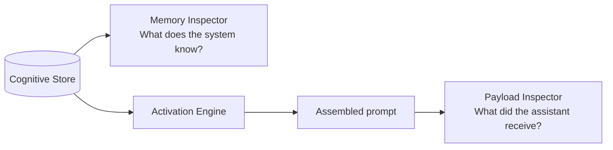

# 10. Transparency and Mutability

Transparency and mutability are **architectural features**, not polish. A memory layer that silently accumulates state and shapes future prompts without showing the user what it holds, or letting them change it, is not an instance of this architecture.

This chapter defines the two required inspection surfaces, the provenance obligations on every rendered asset, the mutation controls, and the information architecture that makes both usable.

---

## The dual-surface pattern

Two inspection surfaces, each answering a different question.



### Memory Inspector

Answers: **"What does the system remember?"**

Shows every stored asset, grouped by type, with full provenance and the controls to change it. It is the Windows Explorer of the cognitive layer — the place where memory is real objects the user can see and manipulate.

### Payload Inspector

Answers: **"What did the assistant actually receive?"**

Shows the full assembled prompt for a given turn, sectioned by static instructions, dynamic memory context, recent history, and the current message. Links each memory item in the dynamic section back to its source asset in the Memory Inspector.

These are **peer surfaces**, not a surface and a debug view. Both are first-class features of the product. Neither replaces the other.

---

## The transparency contract

Every implementation must make these promises and honor them:

- Users can **see** what the system remembers.
- Users can **see where** each memory came from.
- Users can **see whether** memory was injected into a specific prompt.
- Users can **change** memory: edit, delete, archive, suppress, pin.
- Users can **disable** memory influence when they want to.

If a feature cannot be made visible to the user, it should not silently shape the assistant. That is the single hardest invariant in this architecture and the one most often violated by well-intentioned teams.

---

## Memory Inspector: what it must show

### One tab per asset type, plus Activity

The Memory Inspector is organized around the [asset taxonomy](04-asset-taxonomy.md). Each tab renders one type.

| Tab                 | Content                                                              |
| ------------------- | -------------------------------------------------------------------- |
| Activity            | Recent extraction, reconciliation, activation, mutation, sync events |
| Engrams             | Every active engram with full provenance                             |
| Associations        | Every association as a typed, weighted edge                          |
| Salient Digests     | Per-turn structured summaries                                        |
| Meta-Vault          | Durable cross-conversation patterns                                  |
| Consensus Reports   | Per-turn merged proposals (if reconciliation produces them)          |
| (Extraction Log)    | Raw extraction telemetry for developers or advanced users (optional) |

### Provenance on every asset

Every rendered asset card must show, at minimum:

- the human-readable label or content
- the asset's current state
- its source turn (conversation + turn number) or explicit "manual / imported" origin
- its timestamp (created and last-updated, relative time)
- its confidence signal (visible, explainable)
- if produced by one or more models/agents, which ones — "3 models agreed" or "proposed by model X, verified by Y"

### Grouping

For engrams, associations, salient digests, and consensus reports, group by **conversation → turn → card**. This makes the structure of memory match the structure of the conversations that produced it.

For Meta-Vault, the conversation-turn hierarchy does not apply (Meta-Vault is by definition cross-conversation); group by type or scope instead.

### Search and filter

The Memory Inspector must support:

- search by concept/content text
- filter by state (active, archived, suppressed, pending)
- filter by scope (user, workspace, project, conversation)
- filter by time range

Without these, a Memory Inspector becomes unusable at the scale any active user will reach.

### Empty states

Empty states should explain absence, not just show nothing:

- "No engrams have been created yet. Memory will appear here after the first conversation turn is processed."
- "No associations yet. Links are created when related memories are discovered together or used in the same turn."
- "No consensus reports yet. Consensus reports appear when multiple producers propose memory for the same turn."

---

## Payload Inspector: what it must show

### Sectioned assembled prompt

The Payload Inspector shows the exact assembled prompt, broken into the sections the activation engine produced:

- **Static instructions.** System-level instructions that do not depend on memory or conversation state.
- **Dynamic memory context.** Memory injected by the activation engine for this turn.
- **Recent conversation context.** Salient digests and/or verbatim recent turns.
- **Current user message.** What the user just sent.
- **Tool/attachment context.** If applicable.

Each section should be visually distinguishable. The dynamic memory section should show the final assembled block as it was sent to the assistant, plus — **critically** — a map of which stored assets contributed to it.

### Prompt influence map

For each turn, the Payload Inspector must let the user answer:

- Which stored memories were injected?
- Why were they selected, in plain language (for example, "matched the word 'deployment' in your question and is linked to your recent project notes")?
- How much of the prompt budget did they consume?
- Which pinned memories were included?
- Which suppressed memories were excluded?
- Can I stop this memory from being used again?

The last control — "stop using this memory" — is a direct link to suppressing the asset in the Memory Inspector.

### No hidden prompts

There must be **no hidden prompt fragments**. If there is an internal system prompt the user cannot see, you have broken the contract. If commercial or privacy reasons demand redaction, redact explicitly with a visible "redacted system instruction" marker rather than silently hiding content.

---

## Mutability: users are first-class editors

Manual mutability is a core requirement, not a Phase 2 polish item. The minimum viable mutation surface is:

| Action    | Effect                                                                   |
| --------- | ------------------------------------------------------------------------ |
| Edit      | Change an asset's content or label; record the edit in provenance        |
| Delete    | Remove the asset according to product retention policy                   |
| Archive   | Move to archived state; exclude from normal activation; retain history   |
| Suppress  | Keep stored; never inject into any prompt                                |
| Pin       | Raise activation priority; bypass the relevance floor                    |
| Approve   | Move a pending asset to active (exits the review queue)                  |
| Reject    | Move a pending asset to rejected; log the decision                       |
| Restore   | Bring archived memory back to active                                     |

### Who wins on conflict

**User edits always win over automated extraction.** Always. If an extraction pass later proposes a change to an edited item, the pipeline must either skip the update or route it to explicit user approval. This is non-negotiable.

### Edit provenance

Every user mutation updates the asset's provenance block:

```typescript
userEdit: {
  editedAt: string;
  editedBy: string;
  previousContent?: string;
};
```

Edited items are visually distinguishable in the Memory Inspector so the user can see which assets they have personally shaped.

### Confirmations

Destructive actions (delete, reject) should ask for confirmation. Reversible actions (archive, suppress) should not. Undo should be supported where practical — a "just deleted a memory" toast with an immediate undo is worth far more than it costs to build.

### Bulk actions

At scale, single-item mutation is not enough. The Memory Inspector should eventually support:

- multi-select with bulk archive, suppress, delete
- saved filters ("show me everything I flagged as pending")
- export of a filtered selection

These are Phase 2 in most products, but the underlying architecture (typed assets, explicit state, activity log) must support them from Day 1.

---

## Information architecture hierarchy

Within any tab that is conversation-scoped (Engrams, Associations, Salient Digests, Consensus Reports), the hierarchy is:

```text
Conversation
  └── Turn
       └── Asset card
```

Sort: most recent conversation first, most recent turn within conversation first. Default-expand the current conversation and turn.

Within Meta-Vault (which is cross-conversation by definition), group by type (preference / style / domain knowledge / workspace convention) or scope (user / workspace).

---

## Acknowledging the reference implementation gap

The reference implementation's Memory Inspector is **presentation-only** today. Users can see everything; they cannot yet edit anything. Editing is planned but not shipped.

This chapter states the architectural intent. An implementation that lacks editing is incomplete against this architecture. The architecture calls out mutability because it is easy to defer and expensive to retrofit.

If you are adopting this architecture, implement mutability from Day 1 even in minimal form. Do not wait.

---

## What to surface where

A small reference for where transparency-relevant information belongs:

| Information                                         | Memory Inspector | Payload Inspector | Inline chat UI |
| --------------------------------------------------- | ---------------- | ----------------- | -------------- |
| Full list of stored engrams                         | Yes              | No                | No             |
| Provenance for a specific engram                    | Yes              | Linked from here  | No             |
| What the assistant received this turn               | No               | Yes               | Optional hint  |
| Why a specific memory was selected                  | No               | Yes               | No             |
| "3 memories were used in this answer" indicator     | No               | Linked target     | Yes            |
| Pending review queue                                | Yes              | No                | Yes, as a badge|
| Live extraction progress                            | Activity tab     | No                | Optional       |
| Manual create / edit / delete controls              | Yes              | No                | No             |
| Suppress-from-prompts toggle                        | Yes              | Yes               | No             |

The inline chat UI should stay **minimal**. It is the primary product surface and should not become a control panel. "Memory was used in this answer, click to inspect" is a reasonable inline affordance; anything more belongs in the inspectors.

---

## Developer debugging without user confusion

Developers need deeper visibility than end users. Keep the two separate.

### Exposed to end users

- human-readable memory content and labels
- state, scope, provenance in plain language
- review status, edit history
- prompt influence summaries ("this memory was used because...")

### Exposed only to developers (and only in appropriate environments)

- raw internal prompt fragments
- model routing details
- infrastructure-specific identifiers
- raw extraction traces with schema diagnostics
- verifier/reconciliation intermediate output

Mixing these two audiences produces a Memory Inspector that is either too technical for users or too sanitized for developers.

---

## What to read next

- [04-asset-taxonomy.md](04-asset-taxonomy.md) — the asset types whose cards you are rendering
- [09-retrieval-activation.md](09-retrieval-activation.md) — what the Payload Inspector is rendering the result of
- [11-implementation-notes.md](11-implementation-notes.md) — practical notes on building the inspectors
